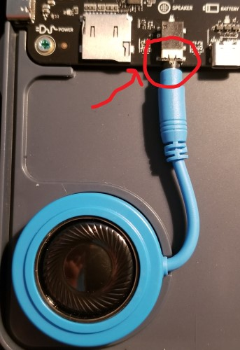
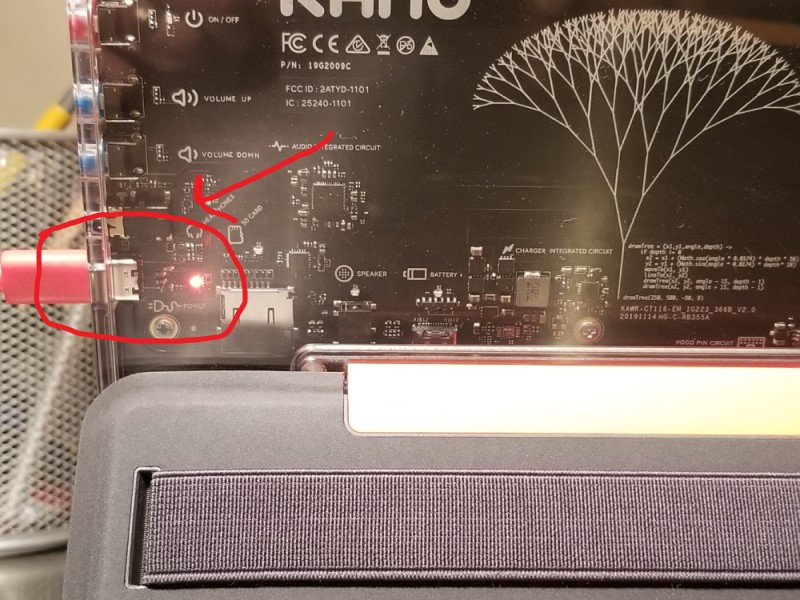

# Lesson 01 - PCs and OSes

In this lesson we'll focus on these concepts.

* Hardware
  * [Personal computer](https://en.wikipedia.org/wiki/Personal_computer) or "PC" for short.
  * [Light-emitting diode](https://en.wikipedia.org/wiki/Light-emitting_diode) or "LED" for short.
* Software
  * [Operating system](https://en.wikipedia.org/wiki/Operating_system) or "OS" for short.
  * [Software as a service](https://en.wikipedia.org/wiki/Software_as_a_service) or "SaaS" for short.
  * [Application software](https://en.wikipedia.org/wiki/Application_software) or "App" for short.

Coaches, see [01-pc-and-os.pptx](./01-pc-and-os.pptx) for presentation materials.

## Hands on

In this hands on exercise, we'll assemble a new [PC](https://en.wikipedia.org/wiki/Personal_computer) from components, then boot it and configure the [OS](https://en.wikipedia.org/wiki/Operating_system). We'll wrap up by launching an [App](https://en.wikipedia.org/wiki/Application_software) and activating a [SaaS](https://en.wikipedia.org/wiki/Software_as_a_service) subscription.

1. First, set up an account you can use to sign in to Microsoft an Kano World.
    1. Parents and guardians, consider creating a [family group](https://account.microsoft.com/family/about) which keeps kids safer online.
    1. Kids, work with a parent or guardian to set up an account you can use to sign in with Microsoft and Kano Club. Make sure the email address for your account is registered at [https://account.microsoft.com](https://account.microsoft.com).
1. Find the name and password of your wireless network.
1. Prepare your workspace. We'll be working with sensitive electronics so make sure there isn't anything around that could damage your PC components like liquids or magnets.
    1. Find a table and a chair close to an AC outlet. Make sure the area is well lit so you can see what you are doing.
    1. Clear everything off the table to give yourself room to work.
    1. Wipe down the top of the table with a damp cloth and let it dry.
    1. Find something you can use to cut tape like a butter knife, a pair of scissors or a letter opener.
1. Watch [this video](https://youtu.be/ElzjzpHoPJ0), then unbox and assemble your Kano PC. Here are a few tips:
    1. Use the *How to make a Personal Computer* booklet to guide you while are assembling your PC. It has lots of great information and tips.
    1. When plugging in the blue speaker, make sure you push the plug all the way in.  
      
    **figure 01-010** Speaker plug properly inserted
    1. Customize your PC by adding stickers to both the keyboard cover and the tablet so you can identify your PC from others.
1. Now let's start charging our PC.
    1. Attach the tablet to the keyboard.
    1. Connect the power cord to the PC.
    1. Plug the power cord into an outlet to charge the battery. You should see a red [LED](https://en.wikipedia.org/wiki/Light-emitting_diode) light up on the circuit board when your PC is getting power.  
      
    **figure 01-020** Red LED indicates that power is properly connected
1. Now let's boot the PC and configure the OS.
    1. Press the power button and the Kano logo should appear on the screen.
    1. Now the Windows setup process will begin.
        1. Choose your region, for example "United States".
        1. Choose your keyboard layout, for example "US".
        1. Choose the second keyboard layout, or click *Skip* if you don't need one.
        1. Connect to your wireless network.
        1. Accept the license agreement.
        1. Sign in using an existing account, or click *create account*.
        1. Choose whether to enable activity history.
        1. Choose whether to text app information to a mobile phone.
        1. Choose whether to enable a digital assistant.
        1. Review and accept privacy settings.
        1. Wait for setup to complete.
        1. Activate Windows by navigating to *Start* > *Settings* > *Updates and Security* > *Activation*.
1. Next, lets launch an [App](https://en.wikipedia.org/wiki/Application_software) called *Kano Code* which is free. We will use the *Kano Code* web app, but rich client versions are also available in the Microsoft, Google and Apple stores.
    1. Locate the *Microsoft Edge* shortcut on the taskbar and click on it.
    1. Open a new tab in the Edge browser by clicking on *+*.
    1. Navigate to Kano World by typing "world.kano.me" into the address bar and pressing *Enter*.
    1. If prompted to allow cookies, click *Allow*.
    1. Join *Kano World* by clicking *Signup* in the top-right. Note, *Kano World is* free but you can add paid content with a *Kano Club* subscription.
    1. Pick a username for *Kano World*. Don't like the one suggested? No problem, just generate another.
    1. Choose a password.
    1. Enter your parent or guardian's email address and choose a region. This will send a permission slip to your parent or guardian.
    1. Wait for your parent or guardian to sign your permission slip.
    1. Sign out by clicking on the avatar in the upper right and selecting *Logout*.
    1. Test that your account works by clicking on *Login* in the upper-right.
    1. Now launch an app by clicking on *Launch* > *Kano Code*.
    1. Click *Login* in the upper right and login using the username and password you created for *Kano World*.
1. Next let's activate a [SaaS](https://en.wikipedia.org/wiki/Software_as_a_service) subscription called *Kano Club* which adds paid content to *Kano World* that we will use in upcoming lessons. The first 30 days are free and the subscription can be cancelled at any time. Have a parent or guardian complete the steps in this section.
    1. Open a new tab in the Edge browser by clicking on *+*.
    1. Navigate to *Kano* by typing "kano.me" into the address bar and pressing *Enter*.
    1. Click on *Club*.
    1. Click on *Get 30 days free* in the upper-right.
    1. Choose the monthly or yearly payment plan.
    1. Enter the parent or guardian's email address and click *Continue*
    1. Enter the parent or guardian's Country and Zip Code and click *Continue*
    1. Choose a payment type (Credit Card or PayPal) and enter the details, then complete the purchase.
    1. Wait for a welcome email from *Kano Club* sent to the parent or guardian's email address.
    1. Follow the instructions in the email to link the *Kano Club* subscription to the kid's *Kano World* account created in the previous section.
    1. Wait for a confirmation email indicating that the subscription was successfully linked to the kid's *Kano World* account.
1. Here's some things you can do later to keep your PC secure.
    1. Regularly install updates by navigating to *Start* > *Settings* > *Update & Security* > *Check for Updates*. There are usually a lot of updates to be installed when you first set up your PC.

## What's next

In the next lesson we'll learn about CPUs and programs. See you next time!
