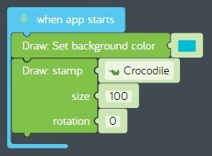
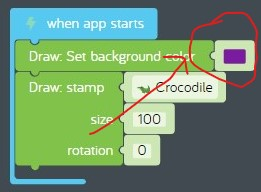
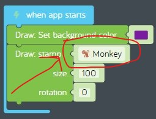

# Lesson 02 - CPU and programs

In this lesson we'll focus on these concepts.

* Hardware
  * [Central processing unit](https://en.wikipedia.org/wiki/Central_processing_unit) or "CPU" for short.
* Software
  * [Programs](https://en.wikipedia.org/wiki/Computer_program)

Coaches, see [02-cpu-and-programs.pptx](./02-cpu-and-programs.pptx) for presentation materials.

## Review

In the previous lesson, we assembled a new [PC](https://en.wikipedia.org/wiki/Personal_computer) from components, then booted it and configured the [OS](https://en.wikipedia.org/wiki/Operating_system). We wrapped up by launching an [App](https://en.wikipedia.org/wiki/Application_software) and activating a [SaaS](https://en.wikipedia.org/wiki/Software_as_a_service) subscription.

## Challenges

It's time to complete a challenge. Keep the challenge open after you complete it.

* [Challenges > Coding Basics > What are blocks?](https://code.kano.me/challenge/loops/FN000_Blocks_1)

## Hands on

In this hands on exercise, we'll create a new [program](https://en.wikipedia.org/wiki/Computer_program) by making changes to the challenge you just completed.

1. Find the challenge you just completed.  
  
**figure 02-010** Completed "What are blocks?" challenge
1. Now let's change the background color to purple. Find the "Draw: set background color" code block. Click on the color and change it from blue to purple.  
  
**figure 02-020** Change background color to purple
1. Finally let's change the stamp from a crocodile to a monkey. Find the "Draw: stamp crocodile" code block and change it from a crocodile to a monkey.  
  
**figure 02-030** Change background color to purple
1. Now share your program. See [what-are-blocks-modified.kcode](./what-are-blocks-modified.kcode) for a completed version.

## What's next

In the next lesson we'll learn about disk storage and variables. See you next time!
