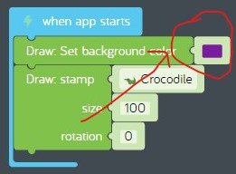

# test.md

## Hands on

In this hands on exercise, we'll make changes to the challenge you just completed.

1. Find the challenge you just completed.  
  
**figure 02-010** Completed "What are blocks?" challenge
1. Now let's change the background color to purple.
    1. Find the "Draw: set background color" code block. Click on the color and change it from blue to purple.  
      
    **figure 02-020** Change background color to purple
1. Finally let's change the stamp from a crocodile to a monkey.  
    1. Find the "Draw: stamp crocodile" code block and change it from a crocodile to a monkey.  
      
    **figure 02-030** Change background color to purple
1. Now share your program. See [what-are-blocks-modified.kcode](./what-are-blocks-modified.kcode) for a completed version.
