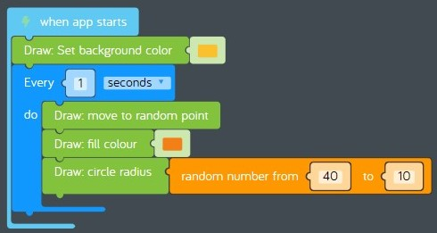
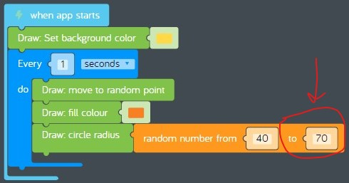

# Lesson 03 - RAM and loops

In this lesson we'll focus on these concepts:

* Hardware
  * [Random access memory](https://en.wikipedia.org/wiki/Random-access_memory) or "RAM" for short.
* Software
  * [Loops](https://www.cs.utah.edu/~germain/PPS/Topics/loops.html)

Coaches, see [03-ram-and-loops.pptx](./03-ram-and-loops.pptx) for presentation materials.

## Review

In the previous lesson we learned about hardware called [central processing units](https://en.wikipedia.org/wiki/Central_processing_unit) or "CPUs" for short, and we learned about software [programs](https://en.wikipedia.org/wiki/Computer_program). In the hands on exercise, we completed a challenge using code blocks to draw a crocodile on the screen, then we created our own program by making changes to the challenge.

## Challenges

It's time to complete a challenge. Keep the challenge open after you complete it.

* [Challenges > Coding Basics > Loops 1: Swiss Cheese](https://code.kano.me/challenge/loops/FN001_loops_1)

## Hands on

In this hands on exercise, we'll make changes to the challenge you just completed.

1. Find the challenge you just completed.  
      
    **figure 03-010** Completed "Loops 1: Swiss Cheese" challenge
1. Now let's change the size of the random holes to make them larger. Right now the program draws holes with a random radius of 10 to 40 pixels. That's a range of 30 pixels (40 - 10 = 30). Let's make the holes bigger by changing the random radius to 40 to 70 pixels. The range will be the same (30 pixels), but the holes will be bigger.
    1. Find the *random number from 40 to 10* code block.
    2. Change the second number from 10 to 70.  
          
        **figure 03-020** Make the swiss cheese holes bigger
1. Now share your creation. See [swiss-cheese-modified.kcode](./swiss-cheese-modified.kcode) for a completed version.

## What's next

In the next lesson we'll learn about disk storage and variables. See you next time!
