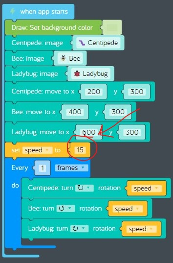

# Lesson 04 - storage and variables

In this lesson we'll focus on these concepts:

* Hardware
  * [Disk storage](https://en.wikipedia.org/wiki/Disk_storage)
* Software
  * [Variables](https://en.wikipedia.org/wiki/Variable_(computer_science))

Coaches, see [04-storage-and-variables.pptx](./04-storage-and-variables.pptx) for presentation materials. See the notes on the last slide for a link to the quiz template.

## Review

In the previous lesson we learned about hardware called [random access memory](https://en.wikipedia.org/wiki/Random-access_memory) or "RAM", and we learned about using [loops](https://www.cs.utah.edu/~germain/PPS/Topics/loops.html) in software. In the hands on exercise, we completed a challenge uses loops to draw randomly sized holes on a block of swiss cheese, then we made changes to the challenge to draw bigger holes.

## Challenges

It's time to complete a challenge. Keep the challenge open after you complete it.

* [Challenges > Variables > Variables 1: Dancing Bugs](https://code.kano.me/challenge/loops/FN004_variables_1)

## Hands on

In this hands on exercise, we'll make changes to the challenge you just completed.

1. Find the challenge you just completed.  
      
    **figure 04-010** Completed "Variables 1: Dancing Bugs" challenge
1. Now let's change the rotation speed of all three stickers by changing the value stored in a single variable.
    1. Find the *set speed to: 2* code block.
    1. Change the number from 2 to 15. The rotation rate changed for all three stickers, pretty cool!  
          
        **figure 04-020** Use the speed variable to change the rotation rate of three different stickers
1. Now share your creation. See [dancing-bugs-modified.kcode](./dancing-bugs-modified.kcode) for a complete version.

## Quiz

It's time for our first quiz! Ask your coach for the link.

## What's next

In the next lesson we'll learn how to write a graphics program. See you next time!
