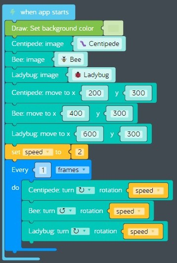

# Lesson 04 - storage and variables

In this lesson we'll be focusing on these concepts:

* [Disk storage](https://en.wikipedia.org/wiki/Disk_storage)
* [Variables](https://en.wikipedia.org/wiki/Variable_(computer_science))

## Review

## Challenges

Before we start, we need to learn about variables by completing this challenges:

* [Challenges > Variables > Variables 1: Dancing Bugs](https://code.kano.me/challenge/loops/FN004_variables_1)

## Hands on

In this lesson we'll use a single variable to control the rotation speed of three different stickers, a centipede, a bee and a ladybug.

1. Keep the last challenge open after you complete it.  
      
    **figure 4-001** Completed "Variables 1: Dancing Bugs" challenge
1. Now let's change the rotation speed of all three stickers by changing the value stored in a single variable.
    1. Find the "set speed to: 2" code block.
    1. Change the number from 2 to 15. The rotation rate changed for all three stickers, pretty cool!  
          
        **figure 4-002** Use a variable to change the rotation rate of three different stickers
1. Now share your creation.

## What's next

In the next lesson we'll learn how to write a computer graphics program. See you next time!
