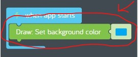
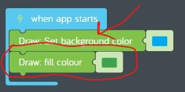
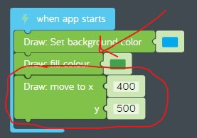
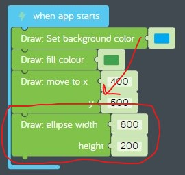
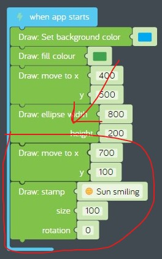

# Lesson 05 - drawing with coordinates

In this lesson we'll be focusing on these concepts:

* [Computer programming](https://en.wikipedia.org/wiki/Computer_programming)
* [Computer graphics](https://en.wikipedia.org/wiki/Computer_graphics)

We'll also introduce a new concept:

* [Event-driven programming](https://en.wikipedia.org/wiki/Event-driven_programming)

## Review

In the previous lesson we learned about [disk storage](https://en.wikipedia.org/wiki/Disk_storage) hardware, and we learned about using [variables](https://en.wikipedia.org/wiki/Variable_(computer_science)) in software programs. In the hands on exercise, we used a single variable to control the rotation speed of three different stickers.

## Challenges

Before we start, we need to learn about computer programming with the *Kano Code editor* and computer graphics with *Drawing with coordinates* by completing these challenges:

* [Challenges > Getting Started With Kano Code > Getting Started With Kano Code](https://code.kano.me/challenge/CLUB01/CLUB01_00_intro)
* [Challenges > Getting Started With Kano Code > Drawing with Coordinates](https://code.kano.me/challenge/CLUB01/CLUB01_05_coordinates)

## Hands on

In this hands on exercise, we'll start building a new program called *baseball toss*. We'll start by drawing a picture of a field on a sunny day.

1. Go to [Kano World](https://world.kano.me) and login.
1. Start the Kano Code editor by navigating to Launch > Kano Code.
1. Start a new creation by navigating to Menu > New Creation.
    1. When asked "Are you sure you want to start again?" click "Yes".
1. Do you see the "when app starts" event in the code space? This is a special code block known as an "event" that fires when your program starts. When the event fires it runs the code inside the code block. Right now there isn't any code inside the "when app starts" event so your program doesn't do anything. That's why you see a blank white canvas to the right. Let's add some code!
1. First, let's change the background color of the canvas to look like a blue sky.
    1. Drag a new "Draw: set background color" code block from the Draw tray on the left and connect it to the inside of the "when app starts" event. Click on the color code block to the right and change the color to blue. You just wrote your first line of code!  
      
    **figure 5-001** Set the canvas background color to blue
1. Next, let's draw a nice grassy hill on our canvas. In order to draw things on the canvas you have to move to the position where you want to draw it. Each position on the canvas has an "x" coordinate and a "y" coordinate. The x coordinate goes from left to right and ranges from 0 to 800. This is known as the "x axis". The y coordinate goes from top to bottom and ranges from 0 to 600. This is known as the "y axis". So the canvas is a square with an x axis and a y axis which is known as a "grid".
    1. To draw our hill we are going to use a shape called an "ellipse" which is like a stretched circle. Before we draw our ellipse we need to set the fill color to green. Drag a new "Draw: fill colour" code block from the Draw tray and connect it to the bottom of the previous code block, then change the color from black to green. Kano's headquarters are in the United Kingdom and they spell the word "color" differently than people in the United States.  
      
    **figure 5-002** Set the fill color to green.
    1. Drag a new "Draw: move to" code block from the Draw tray and connect it to the bottom of the previous code block. We want to draw the grassy hill in the bottom half of the canvas, so let's try changing the x value to 400 which is in the middle of the x axis, and change the y value of 500 which is near the bottom of the canvas.  
      
    **figure 5-003** Move to the center-bottom of the canvas.
    1. Now let's draw our grassy hill. When you draw shapes you have to specify how big the shape is. The size is measured in "pixels", which is a single dot on the screen. Drag a new "Draw: ellipse" code block from the Draw tray and connect it to the previous code block. We can't see the ellipse yet because it is too small and was drawn off the canvas. Set the width to 800 pixels and the height to 200 pixels. Now we can see the top part of the ellipse and it looks like a grassy hill! Try changing the width and height and see what happens.  
      
    **figure 5-004** Draw a grassy hill using an ellipse.
1. Finally, let's draw a sun in the upper-right corner of our canvas. We could just draw a yellow circle, but Kano has some cool shapes called "stamps". Let's use a stamp to draw a picture of a smiley sun.
    1. Drag a new "Draw: move to" code block from the Draw tray and connect it to the bottom of the previous code block. We want to draw the sun in the upper right corner of the canvas, so let's try changing the x value to 700 and the y value to 100.  
    1. Drag a new "Draw: stamp" code block from the Draw tray and attach it to the previous code block. Wait, that drew a crocodile in the sky, and we want a sun. Change the stamp from "Crocodile" to "Sun smiling". Try changing the size and rotation and see what happens.  
      
    **figure 5-005** Draw a "Sun smiling" stamp.
1. Now share your creation so everybody knows you can write a computer graphics program! See [baseball-toss.kcode](./baseball-toss.kcode) for a completed version.

## What's next

In the next lesson we'll add an alien that tosses baseballs to our *baseball toss* sample. See you next time!
