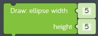

# Lesson 05 - drawing with coordinates

In this lesson we'll be focusing on these concepts:

* [Programming](https://en.wikipedia.org/wiki/Computer_programming)
* [Events](https://en.wikipedia.org/wiki/Event-driven_programming)
* [Graphics](https://en.wikipedia.org/wiki/Computer_graphics)

Coaches, see [05-drawing-with-coordinates.pptx](./05-drawing-with-coordinates.pptx) for presentation materials.

## Review

In the previous lesson we learned about [disk storage](https://en.wikipedia.org/wiki/Disk_storage) hardware, and we learned about using [variables](https://en.wikipedia.org/wiki/Variable_(computer_science)) in software programs. In the hands on exercise, we completed a challenge that used a variable to control the rotation speed of three different stickers.

## Challenges

Before we start, we need to learn about [programming](https://en.wikipedia.org/wiki/Computer_programming) and [graphics](https://en.wikipedia.org/wiki/Computer_graphics) by completing these challenges:

* [Challenges > Getting Started With Kano Code > Getting Started With Kano Code](https://code.kano.me/challenge/CLUB01/CLUB01_00_intro)
* [Challenges > Getting Started With Kano Code > Drawing with Coordinates](https://code.kano.me/challenge/CLUB01/CLUB01_05_coordinates)

## Hands on

In this hands on exercise, we'll start building a new program called *baseball toss*. We'll start by drawing a picture of a grassy field on a sunny day.

1. Start the *Kano Code* app which we will use for [programming](https://en.wikipedia.org/wiki/Computer_programming).
1. Start a new creation by clicking on  *Menu* > *New Creation*.
    1. When asked "Are you sure you want to start again?" click *Yes*. This wipes out whatever is in RAM and resets the *Kano Code* app to a blank program.
1. Do you see the *when app starts* code block? This kind of code block is known as an [event](https://en.wikipedia.org/wiki/Event-driven_programming). The *when app starts* event fires when the *Kano Code* app starts. When an event fires it runs the code inside the code block. Right now there isn't any code inside *when app starts* so your program doesn't do anything. That's why you see a blank white canvas to the right.  
  
**figure 00-010-010** *when app starts* code block from the *App* tray
1. Let's add some code! First, let's change the background color of the canvas to look like a blue sky.
    1. Find the *set background color* code block in the *Draw* tray on the left.  
      
    **figure 00-080-010** *set background color* code block from the *Draw* tray
    1. Drag a new *set background color* code block from the *Draw* tray and connect it to the inside of the *when app starts* code block. Click on the color code block to the right and change the color from white to blue. You just wrote your first line of code!  
      
    **figure 05-010** Set the background color to blue
1. Now let's draw a nice grassy hill on our canvas. In order to do that we need to move to the position where you want to draw it. Each position on the canvas has an "x" coordinate and a "y" coordinate. The x coordinate goes from left to right and ranges from 0 to 800. This is known as the "x axis". The y coordinate goes from top to bottom and ranges from 0 to 600. This is known as the "y axis". So the canvas is a square with an x axis and a y axis which is known as a "grid". To draw our hill we are going to use a shape called an "ellipse" which is like a stretched circle.
    1. Before we draw our ellipse we need choose what color to fill the inside of the ellipse with. Find the *fill colour* code block in the *Draw* tray.  
      
    **figure 00-080-040** *set fill colour* code block from the *Draw* tray
    1. Drag a new *fill colour* code block from the *Draw* tray and connect it to the bottom of the previous code block. We want the ellipse to look like grass so change the change the color from black to green.  
      
    **figure 05-020** Set the fill color to green.
    1. Next we need to move to the position where we want to draw our ellipse. Find the *move to* code block in the *Dray* tray.  
      
    **figure 00-080-130** *move to* code block from the *Draw* tray
    1. Drag a new *move to* code block from the *Draw* tray and connect it to the bottom of the previous code block. We want to draw the ellipse in the bottom half of the canvas, so change the x value to 400 which is in the middle of the x axis, and change the y value of 500 which is near the bottom of the canvas.  
      
    **figure 05-030** Move to the center-bottom of the canvas.
    1. Now that we are in the right position on the canvas we can draw our grassy hill. Find the *ellipse* code block in the *Draw* tray.  
      
    **figure 00-080-130** *ellipse* code block from the *Draw* tray
    1. Drag a new *ellipse* code block from the *Draw* tray and connect it to the previous code block. When you draw shapes you have to specify how big the shape is. The size is measured in "pixels", which is a single dot on the screen. We can't see the ellipse yet because it is too small and was drawn off the canvas. Set the width to 800 pixels and the height to 200 pixels. Now we can see the top part of the ellipse and it looks like a grassy hill!  
      
    **figure 05-040** Draw a grassy hill using an ellipse.
1. Finally, let's draw a sun in the upper-right corner of the canvas. We could just draw a yellow circle, but the *Kano Code* app has some cool shapes called "stamps". Let's use a stamp to draw a picture of a smiley sun.
    1. Drag a new *move to* code block from the *Draw* tray and connect it to the bottom of the previous code block. We want to draw the sun in the upper right corner of the canvas, so let's try setting the x value to 700 and the y value to 100.
    1. Now that we are in the right position we need to draw our stamp. Find the *stamp* code block in the *Draw* tray.  
      
    **figure 00-080-190** *stamp* code block from the *Draw* tray
    1. Drag a new *stamp* code block from the *Draw* tray and attach it to the previous code block. Change the stamp from "Crocodile" to "Sun smiling". Try changing the size and rotation and see what happens.  
      
    **figure 05-050** Draw a "Sun smiling" stamp.
1. Now share your creation so everybody knows you can write a graphics program! See [baseball-toss.kcode](./baseball-toss.kcode) for a completed version.

## What's next

In the next lesson we'll add an alien that tosses baseballs to our *baseball toss* sample. See you next time!
