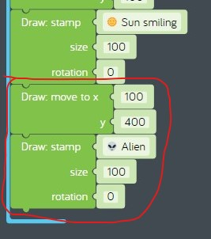
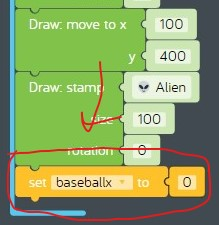
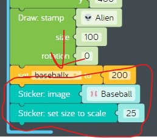
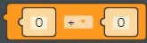
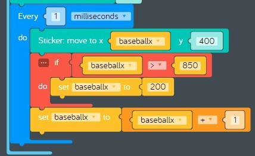

# Lesson 06 - loops and variables

In this lesson we'll be focusing on these concepts:

* [Loops](https://www.cs.utah.edu/~germain/PPS/Topics/loops.html)
* [Variables](https://www.cs.utah.edu/~germain/PPS/Topics/variables.html)
* [Computer animation](https://en.wikipedia.org/wiki/Computer_animation)

We'll also introduce these new topics:

* [Conditional computer programming](https://en.wikipedia.org/wiki/Conditional_(computer_programming))
* [Object-oriented programming](https://en.wikipedia.org/wiki/Object-oriented_programming)

## Review

In the previous lesson we created our *baseball toss* sample and drew a picture of a field on a sunny day. To do this we needed to learn some new programming concepts.

* [Computer Programming](https://en.wikipedia.org/wiki/Computer_programming)
  * *Kano Code* editor
* [Computer Graphics](https://en.wikipedia.org/wiki/Computer_graphics)
  * *Draw* code blocks
    * set background color
    * fill colour
    * move to
    * ellipse
    * stamp

## Challenges

Before we start coding, we need to learn about *Loops* and *Variables* by completing these challenges:

* [Challenges > Loops > Working with Loops](https://code.kano.me/challenge/CLUB02/CLUB02_00_random)
* [Challenges > Variables > What are Variables?](https://code.kano.me/challenge/CLUB03/CLUB03_00_catandmouse)
* [Challenges > Variables > Animating with Variables](https://code.kano.me/challenge/CLUB03/CLUB03_01_balloon)

## Hands on

In this hands on exercise, we'll make improvements to the *baseball toss* program by adding an alien who tosses baseballs across the canvas over and over again.

1. Remix the last version of the *baseball toss* sample you shared. If you can't find it, don't worry, just import it from [baseball-toss.kcode](../05-drawing-with-coordinates/baseball-toss.kcode)
1. Let's add an alien stamp to the lower-left part of the canvas.
    1. Drag a new "Draw: move to x y" code block from the "Draw" tray and attach it to the last code block in the "when app starts" event. Set the x coordinate to 100 and the y coordinate to 400.
    1. Drag a new "Draw: stamp" code block from the "Draw" tray and attach it to the previous code block. Change the stamp to "Alien".  
      
    **figure 6-001** Add an alien stamp
1. Next we need to set the drawing position for a new baseball sticker. We’ll do this by creating a variable to set the initial drawing position on the x axis.
    1. Drag a new "Set item to" code block from the "Variables" tray and attach it to the previous block. Create a new variable by clicking on the drop-down next to the word "item" and select "Create variable" and set the new variable name to "baseballx".
    1. Drag a new "number" code block from the "Variables" tray and connect it to the right of the previous block. Change the number from 0 to 200. That means the baseball toss will begin to the right of the alien which is at position 100.  
      
    **figure 6-002** Add a variable named "baseballx" and set it to 200.
1. Add a new Sticker part for the baseball and move it to the starting position of the baseball toss.
    1. Click the "+" button in the "Add Parts" section and click on "Sticker". A crocodile shows up in the middle of the canvas because that is the default sticker image. Notice a new "Sticker" section shows up at the bottom of the tray on the left with new code blocks that belong to the Sticker. A Sticker is actually a type of object. Objects have their own programs known as "methods" and their own data known as "properties". Using objects in code is very powerful because they can be controlled independently from other objects in the same program.
    1. Drag a new "Sticker image" code block from the "Sticker" tray and attach it to the previous code block. Change the image from "Crocodile" to "Baseball". Now you should see a big baseball in the middle of the canvas.
    1. Drag a new "Sticker: set size to scale" code block from the "Sticker" tray and attach it to the previous code block. Change the number from 100 to 25.  
      
    **figure 6-003** Add a new Sticker part and change it to a baseball
1. Okay now for the cool part, tossing the baseball! To do that we are going to need a loop which runs the same code over and over again which moves the baseball to a new location every time the code inside the loop runs. Drag a new "Every 1 seconds" loop from the "Control" tray and attach it to the previous code block. Change "seconds" to "milliseconds" to make the baseball move faster. Do you know how many milliseconds are in a second?
1. Drag a new "Sticker: move to x y" code block from the "Sticker" tray and connect it to the inside of the "Every 1 milliseconds" loop. Change the y coordinate from 0 to 400, which is the same as the alien.
1. Drag a new "get variable" code block from the "Sticker" tray and connect it to the x coordinate of the "Every 1 milliseconds" loop. Change the variable from "item" to the variable you created earlier called "baseballx". Now the baseball is getting moved to the same spot right next to the alien over and over again. How do we get it to move?
1. We can get the baseball to move along the x axis by changing the value of the "baseballx" variable inside the loop. We need to make sure that the new position is still on the canvas, and if it's not, reset "baseballx" to the starting position of the baseball toss.
    1. Drag a new "if do" code block from the "Logic" tray and connect it to the previous code block. This code block tests a condition, and if it's true it runs the code in the do section.
    1. Find the "logic compare" code block in the "Logic" tray.  
          
        **figure 6-004** "logic compare" code block
    1. Drag a new "variable get" code block from the "Variables" tray and drop it into the first slot of the new "logic compare" expression. Change "item" to "baseballx".
    1. Drag a new "number" code block from the "Variables" tray and drop it into the second slot of the new "logic compare" expression. Change the number 0 to 850. Remember, the x axis of the canvas only goes from 0 to 800, so 850 is off the right side of the canvas in imaginary space. This will make it look like the baseball is getting tossed off the canvas.
    1. Next we need to add the code to the "do" section of the "if do" logic code block. Remember this code gets run only when the expression tested by "if" is true. Drag a new "set item to" code block from the Variables tray and connect it to the inside of the "if do" logic code block. Change "item" to "baseballx".
    1. Drag a new number code block from the Variables tray and connect it to the right of the "set baseballx to" code block. Change the number from 0 to 200, which is the starting position of the baseball toss on the x axis.
    1. The final step is to add the code which makes the baseball move by increasing the value of the variable "baseballx". Drag a new "set item to" code block from the Variables tray and connect it to the bottom of the "if do" logic code block. Change "item" to "baseballx".
    1. Find the "math arithmetic" code block in the Math tray.  
          
        **figure 6-005** "math arithmetic" code block
    1. Drag a new "math arithmetic" code bock from the Math tray and connect it to the right of the "set baseballx to" code block. You are going to use this to add 1 to the current value of the "baseballx" variable which will make the baseball move.
        1. Drag a new "variable get" code block from the Variable tray and drop it into the first slot of the new "math arithmetic" code block. Change "item" to "baseballx".
        1. Change the number in the second slot of the new "math arithmetic" object from 0 to 1. Check it out the baseball is moving!  
      
        **figure 6-006** Loop code which moves the baseball
1. Try changing the starting position of where the baseball toss begins by changing the initial setting of the "baseballx" from 200 to some other number. What happened?
1. Now share your creation and everybody will know that you can write computer animation programs! See [baseball-toss-remix-1.kcode](./baseball-toss-remix-1.kcode) for a completed version.

## What's next

In the next lesson we will make our code better by having the alien toss the baseball to different locations on the canvas. See you next time!
