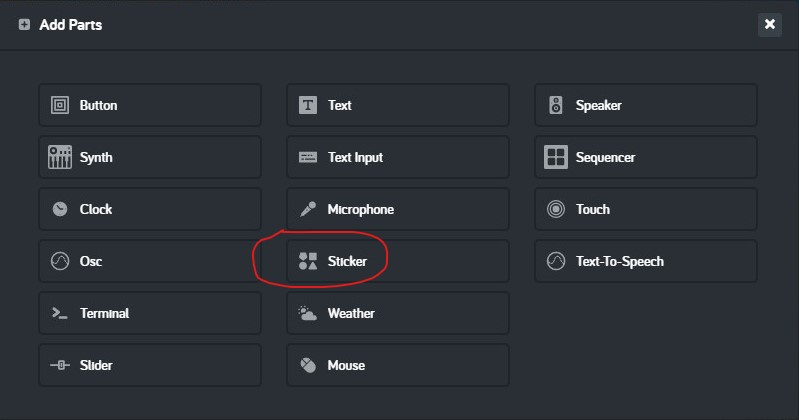
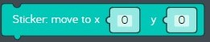
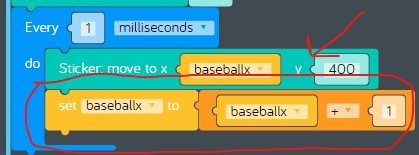

# Lesson 06 - loops and variables

In this lesson we'll be focusing on these concepts:

* [Arithmetic](https://en.wikipedia.org/wiki/Arithmetic)
* [Conditional programming](https://en.wikipedia.org/wiki/Conditional_(computer_programming))
* [Loops](https://www.cs.utah.edu/~germain/PPS/Topics/loops.html)
* [Variables](https://www.cs.utah.edu/~germain/PPS/Topics/variables.html)
* [Object-oriented programming](https://en.wikipedia.org/wiki/Object-oriented_programming)
* [Computer animation](https://en.wikipedia.org/wiki/Computer_animation)

## Review

In the previous lesson we created our *baseball toss* sample and drew a picture of a field on a sunny day. To do this we needed to learn some new programming concepts.

* [Computer programming](https://en.wikipedia.org/wiki/Computer_programming)
  * [Kano Code](https://www.microsoft.com/store/productId/9P4Q1393C2DZ) app
* [Computer graphics](https://en.wikipedia.org/wiki/Computer_graphics)
  * *Draw* code blocks
    * set background color  
      
    **figure 00-080-010** "Set background color" code block from Draw tray
    * fill colour  
      
    **figure 00-080-040** "Fill colour" code block from Draw tray
    * move to  
      
    **figure 00-080-070** "Move to" code block from Draw tray
    * ellipse  
      
    **figure 00-080-130** "Ellipse" code block from Draw tray
    * stamp  
      
    **figure 00-080-190** "Stamp" code block from Draw tray

## Challenges

Before we start coding, we need to learn about *Loops* and *Variables* by completing these challenges:

* [Challenges > Loops > Working with Loops](https://code.kano.me/challenge/CLUB02/CLUB02_00_random)
* [Challenges > Variables > What are Variables?](https://code.kano.me/challenge/CLUB03/CLUB03_00_catandmouse)
* [Challenges > Variables > Animating with Variables](https://code.kano.me/challenge/CLUB03/CLUB03_01_balloon)

## Hands on

In this hands on exercise, we'll make improvements to the *baseball toss* program by adding an alien who tosses baseballs across the canvas over and over again.

1. Remix the last version of the *baseball toss* sample you shared. If you can't find it, don't worry, just import it from [baseball-toss.kcode](../05-drawing-with-coordinates/baseball-toss.kcode)
1. Let's add an alien stamp to the lower-left part of the canvas.
    1. Drag a new "Draw: move to x y" code block from the "Draw" tray and attach it to the last code block inside the "when app starts" event. Set the x coordinate to 100 and the y coordinate to 400 which is in the lower-left section of the canvas.
    1. Drag a new "Draw: stamp" code block from the "Draw" tray and attach it to the previous code block. Change the stamp to "Alien".  
      
    **figure 06-010** Add an alien stamp
1. Next we need to set the drawing position for a new baseball sticker. We’ll do this by creating a [variable](https://www.cs.utah.edu/~germain/PPS/Topics/variables.html) to set the initial drawing position on the x axis.
    1. Find the "set variable" code block on the Variables tray.  
      
    **figure 00-050-040** "Set variable" code block in the Variables tray
    1. Drag a new "set variable" code block from the Variables tray and attach it to the previous block. Create a new variable by clicking on the drop-down next to the word "item" then select "Create variable". Set the new variable name to "baseballx".
    1. Find the "number" code block on the Variables tray.  
      
    **figure 00-050-010** "Number" code block in the Variables tray
    1. Drag a new "number" code block from the "Variables" tray and connect it to the right of the previous block. Change the number from 0 to 200. That means the baseball toss will begin to the right of the alien which is at position 100.  
      
    **figure 06-020** Add a variable named "baseballx" and set it to 200.
1. Now let's use [object-oriented programming](https://en.wikipedia.org/wiki/Object-oriented_programming) to add a baseball using a new Sticker part.
    1. Find the "Add parts" section in the lower right underneath the canvas.  
      
    **figure 00-500-000** Add parts
    1. Click "Add Parts".
    1. Click on "Sticker" in the "Add Parts" list. A crocodile shows up in the middle of the canvas because that is the default sticker image.  
      
    **figure 00-500-000** Add a "Sticker" part
    1. Notice a new Sticker section shows up at the bottom of the tray on the left. A Sticker is a type of object. Objects have their own programs known as "methods" and their own data values known as "properties". Using objects in code is very powerful because each object can be controlled separately from other objects in the same program. Click on the Sticker tray to see all of its methods and properties, then find the "image" code block.  
      
    **figure 00-500-110** "Image" code block in the Sticker tray.
    1. Drag a new "image" code block from the Sticker tray and attach it to the previous code block. Change the image from "Crocodile" to "Baseball". Now you should see a big baseball in the middle of the canvas.
    1. Find the "set size to scale" code block in the Sticker tray.  
      
    **figure 00-500-160** "Set size to scale" code bock in the Sticker tray.
    1. Drag a new "set size to scale" code block from the Sticker tray and attach it to the previous code block. Make the baseball smaller by changing the scale from from 100 to 25.  
      
    **figure 06-030** Add a new Sticker part and change it to a baseball
1. So how do we make the baseball move? To do that we are going to use a [loop](https://www.cs.utah.edu/~germain/PPS/Topics/loops.html) that runs the same [computer animation](https://en.wikipedia.org/wiki/Computer_animation) code over and over again. Each time the code in the loop runs the Sticker will get moved to a new position on the canvas.
    1. Find the "every do" loop code block in the Control tray.  
      
    **figure 00-020-010** "Every do" loop code block form the Control tray.
    1. Drag a new "every do" loop code block from the Control tray and attach it to the previous code block. Change "seconds" to "milliseconds" to make the baseball move faster. Do you know how many milliseconds are in a second?
    1. Find the "move to" code block from the Sticker tray.  
      
    **figure 00-500-170** "Move to" code block in the Sticker tray.
    1. Drag a new "move to" code block from the Sticker tray and connect it to the inside of the "Every 1 milliseconds" loop. Change the y coordinate from 0 to 400, which is the same as the alien. This means that our baseball will not move up or down on the y axis.
    1. Find the "get variable" code block in the Variables tray.  
      
    **figure 00-050-050** "get variable" code block from the Variables tray.
    1. Drag a new "get variable" code block from the Variables tray and connect it to the x coordinate of the "move to" code block. Change the variable from "item" to "baseballx". This means that our baseball will move back and forth on the x axis.
    1. In order to get the baseball to move we need to change the value of "baseballx" inside the loop. Drag a new "set item to" code block from the Variables tray and connect it to the bottom of the "move to" code block. Change "item" to "baseballx".
    1. We need to use [arithmetic](https://en.wikipedia.org/wiki/Arithmetic) to change the value of "baseballx". Find the "arithmetic" code block in the Math tray.  
      
    **figure 00-040-020** "Arithmetic" code block in the Math tray
    1. Drag a new "math arithmetic" code bock from the Math tray and connect it to the right of the "set baseballx to" code block.
    1. Drag a new "get variable" code block from the Variable tray and drop it into the first slot of the new "arithmetic" code block. Change "item" to "baseballx".
    1. Change the number in the second slot of the new "math arithmetic" object from 0 to 1. The baseball is now moving but we only got one toss. This is because the baseball keeps going after it moves off the right side of the canvas.  
      
    **figure 06-040** Loop code which moves the baseball
    1. We need to use [conditional programming](https://en.wikipedia.org/wiki/Conditional_(computer_programming)) to reset "baseballx" when the x coordinate is off the right side of the canvas.
        1. Find the "if do" code block in the Logic tray.  
          
        **figure 00-030-010** "If do" code block from the Logic tray.
        1. Drag a new "if do" code block from the "Logic" tray and connect it to the previous code block. This code block tests a condition, and if it's true it runs the code in the "do" section.
            1. Find the "compare" code block in the Logic tray.  
              
            **figure 00-030-030** "Compare" code block in Logic tray
            1. Drag a new "variable get" code block from the Variables tray and drop it into the first slot of the new "compare" code block. Change "item" to "baseballx".
            1. Drag a new "number" code block from the Variables tray and drop it into the second slot of the new "compare" code block. Change the number 0 to 850. Remember, the x axis of the canvas only goes from 0 to 800, so 850 is off the right side of the canvas in imaginary space. This will make it look like the baseball is getting tossed off the canvas.  
              
            **figure 06-050** "If do" code block checks of "baseballx" is greater than 850.
            1. Next we need to add the code to the "do" section of the "if do" code block. Remember this code gets run only when the expression tested by "if" is true.
                1. Drag a new "set variable" code block from the Variables tray and connect it to the inside of the "if do" logic code block. Change "item" to "baseballx".
                1. Drag a new "number" code block from the Variables tray and connect it to the right of the "set baseballx to" code block. Change the number from 0 to 200, which is the starting position of the baseball toss on the x axis.  
                  
                **figure 06-060** Reset "baseballx" to 200.
1. Check it out, when the baseball moves off the right side of the canvas, the alien tosses it again! Now share your creation and everybody will know that you can write computer animation programs! See [baseball-toss-remix-1.kcode](./baseball-toss-remix-1.kcode) for a completed version.

## What's next

In the next lesson we will make our code better by having the alien toss the baseball to different locations on the canvas. See you next time!
