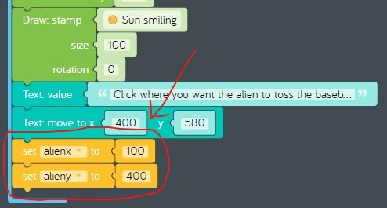
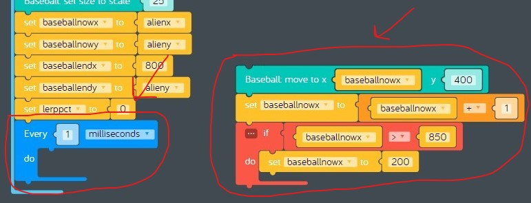

# Lesson 07 - Events and Linear Interpolation

In this lesson we'll be learning about two key new concepts:

* [Event-driven programming](https://en.wikipedia.org/wiki/Event-driven_programming)
* [Linear interpolation](https://en.wikipedia.org/wiki/Linear_interpolation) more commonly known as *lerp*

## Review

In the previous lesson we continued working on the *baseball toss* sample and added some computer animation code that shows an alien tossing baseballs. To do this we needed to learn some new programming concepts.

* [Conditional computer programming](https://en.wikipedia.org/wiki/Conditional_(computer_programming))
  * *Logic* code blocks
    * if do
    * logic compare
* [Ojbect-oriented programming](https://en.wikipedia.org/wiki/Object-oriented_programming)
  * *Part* code blocks
    * Sticker
* [Computer animation](https://en.wikipedia.org/wiki/Computer_animation)
  * *Control* code bocks
    * Every x milliseconds
  * *Part* code blocks
    * Sticker: move to

## Challenges

Before we start coding, we need to learn about *Events* and *Lerp* by completing these challenges:

* [Challenges > Events > Create a Paintbrush](https://code.kano.me/challenge/CLUB04/CLUB04_01_paint)
* [Challenges > Animation > Learning to Lerp](https://code.kano.me/challenge/CLUB012/CLUB012_01_lerp)

## Lesson

In this lesson we'll make more improvements to the *baseball toss* sample. Right now our alien tosses baseballs over and over again to the same spot. Kind of boring huh? Wouldn't it be cool if we could add some code to make the alien toss baseballs to different places on the canvas?

1. Remix the last version of the *baseball toss* sample you shared.
1. Move all of the code blocks after the "Draw: stamp sun smiling" and park them to the side. We will use some of them later.
1. Add some instructions to the bottom of the canvas.
    1. Add a new *Text* part.
    1. Drag a new "Text: value 'Text'" code block from the *Text* tray and connect it to the bottom of the "Draw: stamp Sun smiling" code block.
    1. Change the value "Text" to "Click where you want the alien to toss the baseball"
    1. Drag a new "Text: move to x y" code block from the *Text* tray and connect it to the bottom of the previous code block. Change the coordinates to x = 400, y= 580.  
          
        **figure 7-001** New help text
1. Add two new variables named "alienx" and "alieny" that we can use to control where the alien gets drawn. This will make it easy to move the alien later, or to refer to the current position of the alien when the baseball gets tossed.
    1. Set "alienx" to "100".
    1. Set "alieny" to "400".  
          
        **figure 7-002** New variables
1. Find the "Draw: move to" and "Draw: stamp Alien" code blocks you parked and attach them to the previous code bock. Set the x and y coordinates of the "Draw: move to" code block to the "alienx" and "alieny" variables.  
      
    **figure 7-003** Use variables to draw the Alien
1. Find the  "Sticker: image Baseball" and "Sticker: set size to scale 25" code blocks you parked and attach them to the previous code block.
    1. Rename the "Sticker" part to "Baseball" by changing the name in the "Add Parts" section. This will make your code more readable.  
          
        **figure 7-004** Rename the Sticker part to "Baseball"
1. Find the "Set baseballx to 200" code block you parked and attach it to the previous code block.
    1. Rename "baseballx" to "baseballnowx" by clicking the dropdown arrow and choosing "Rename variable". We are going to be adding a lot more variables and this will make your code more readable. This variable will track the current x coordinate of the baseball.
    1. Set the value of "baseballnowx" to the variable "alienx". This will ensure that the baseball always gets tossed from the same x coordinate where the alien was drawn.  
          
        **figure 7-005** Modify "baseballx" variable
1. Create three new variables we will use to track the starting and ending coordinates of the baseball toss.
    1. Add a variable "baseballnowy" and set it to "alieny". This variable will track the current y coordinate of the baseball.
    1. Add a variable "baseballendx" and set it to "800". This variable will be used to set the x coordinate of where the baseball is tossed. We'll set it to 800 initially because we have to start tossing the baseball somewhere.
    1. Add a variable "baseballendy" and set it to "alieny". This variable will be used to set the y coordinate of where the baseball is tossed. We'll set it to be the same as the variable "alieny" initially because we have to start tossing the baseball somewhere.  
          
        **figure 7-006** New variables
1. Create a new variable named "lerppct" and set it to "0". We will use this later inside the loop when we're moving the baseball sticker using the "lerp from" code block.  
      
    **figure 7-007** New "lerpct" variable
1. Find the "Every 1 milliseconds" loop you parked and attach it to the previous code block. Drag all the code blocks inside of it to the right and park them to the side.  
      
    **figure 7-008** Every 1 milliseconds loop
1. We need to add some logic to reset the "lerppct" variable to 0 inside the loop. The "lerppct" variable is a percentage that will change from 0 to 100. When the baseball toss starts the "lerppct" will be 0, then halfway through the baseball toss the "lerppct" will be 50, then at the end of the baseball toss "lerppct" will be 100. If "lerpct" is larger than 100 we need to reset it back to 0 for a new baseball toss.
    1. Drag a new "if do" code block from the Logic tray and connect it inside the "Every 1 milliseconds" loop.
    1. Drag a new "logic compare" expression from the Logic tray and connect it to the right of "if".
        1. Set the first value to the "lerppct" variable.
        1. Change the comparison operator from "=" to ">" which means "greater than".
        1. Set the second value to "100"
    1. Drag a new "set item to" code block from the variables tray and connect it to the bottom of "if". Change "item" to "lerppct" and set the value to 0.  
      
    **figure 7-009** Reset the "lerppct" variable when it gets larger than 100
1. Find the "Baseball: move to x y" code block you parked and attach it to the bottom of the "if do" but still inside the "Every 1 milliseconds" loop. Change the y coordinate from "400" to the variable "baseballnowy". You can go ahead and toss the rest of the code blocks you have parked to the right in the trash, you won't be needing them.  
      
    **figure 7-010** Add "Baseball: move to" back into the loop
1. Now we need to add some code at the end of the loop that adjusts the values of the "baseballnowx" and "baseballnowy" variables so that each time the loop runs the baseball will move. Calculating the next x and y coordinate where the baseball should move isn't as easy as it sounds. Fortunately Kano Code includes a *lerp* code block. "lerp" is short for "linear interpolation", which is a mathematical formula used to estimate where a given number should be on a scale using a percentage. Since we need to calculate both an x and a y coordinate for the baseball to move to, we are going to use the lerp code block twice inside our loop.
    1. Drag a new "set item to" code block from the Variables tray and attach it to the bottom of the "Baseball: move to x" code block. Change "item" to "baseballnowx".
    1. Drag a new "lerp from 0 to 200 % 50" code block from the Math tray and attach it to the right of the "set baseballx to" codeblock you just created.
        1. Change "0" to the variable "alienx". This means the x coordinate range will always start at the same x position as the alien.
        1. Change "200" to the variable "baseballendx". This means the x coordinate range will end at "baseballendx". We originally set this to 800 so that when the program starts the alien is tossing the baseball from left to right.
        1. Change "50" to the variable "lerppct".  
              
            **figure 7-011** Move the baseball along the x axis using a *lerp* calculation
    1. Now we need to do the same thing for the y coordinate stored in the "baseballnowy" variable. Let's use a shortcut. Right-click on the "set baseballnowx to" code block and select "Duplicate", attach the new code block to the bottom of the previous code block, and make the following changes:
        1. Change "baseballnowx" to "baseballnowy".
        1. Change "alienx" to "alieny".
        1. Change "baseballendx" to "baseballendy".  
              
            **figure 7-012** Move the baseball along the y axis using a *lerp* calculation
1. We only have one thing left to do to complete our loop. In order to get our baseball to move we need to increase the value of the "lerppct" variable. This can be done easily with a single codeblock.
    1. Drag a new "item += 1" code block from the math tray and connect it to the bottom of the previous code block.
    1. Change "item" to "lerppct". This code block will now add 1 to the current value of the "lerppct" variable and store the result back into the "lerppct" variable.  
      
    **figure 7-013** Increment the value of the "lerppct" variable by one
1. Now comes the really cool part. Let's add a new "Mouse" part to our code, then use it to make the alien throw the baseball to different spots on the canvas.
    1. Add a new "Mouse" part.
    1. Drag a new "Mouse: on click" event from the "Mouse" tray onto the code space and drop it to the right of the "When app starts" code block. Events are separate pieces of code that run only when the associated event fires, which in this case is when the mouse button is clicked. Click in the canvas a few times, do you see the lightning bolt on the "Mouse: on click" event light up? That means the event is firing, but since there is no code inside the "Mouse: on click" event nothing happens.
    1. Every time the mouse gets clicked we want the alien to start a new baseball toss. To do this we need to reset the values of the "baseballnowx" and "baseballnowy" variables back to where the baseball toss starts, which is where the alien is drawn.
        1. Drag a new "set item to" code block from the Variables tray attach it to the inside of the "Mouse: on click" event. Change "item" to "baseballnowx".
        1. Drag a new "item" code block from the Variables tray and attach it to the end of the "set item to" block you just added. Change "item" to "alienx"
        1. Repeat this same process for the "baseballnowy" variable. Hint: use the "Duplicate" feature as a shortcut.
    1. We are almost done! Now that we've reset the x and y coordinates for the beginning of the baseball toss, we will grab the x and y coordinates from the "Mouse: on click" event and use them to set the x and y coordinates for the end of the baseball toss.
        1. Drag a new "set item to" code block from the Variables tray attach it to the previous code block. Change "item" to "baseballendx".
        1. Drag a new "Mouse: x" code block from the Mouse tray and attach it to the end of the "set item to" block you just added.
        1. Drag a new "set item to" code block from the Variables tray attach it to the previous code block. Change "item" to "baseballendy".
        1. Drag a new "Mouse: y" code block from the Mouse tray and attach it to the end of the "set item to" block you just added. Now click in the canvas, the alien should be tossing the baseball to the location you clicked on.  
          
        **figure 7-014** Use a click event to change the location where the alien tosses the baseball
1. Try changing the position of the alien by moving them from 100, 400 to 150, 350. Remember, we set up variables that are used to set the position where the alien is drawn. Does the code still work after you moved where the alien is drawn?
1. Now share your creation so you can show everybody what an awesome event driven computer animation coder you are!
