# Lesson 08 - games and sound

In this lesson we'll cover some new topics:

* [PC game](https://en.wikipedia.org/wiki/PC_game)
* [Digital audio](https://en.wikipedia.org/wiki/Digital_audio)

## Review

In the previous lesson, we made some improvements to our *baseball toss* program by adding code to make the alien toss baseballs to different places on the canvas. To do this we used two new concepts:

* [Events](https://en.wikipedia.org/wiki/Event-driven_programming)
  * *Mouse* code blocks
    * *on click*  
    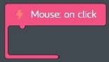  
    **figure 00-500-280** *on click* event code block from the *Mouse* tray
* [Linear interpolation](https://en.wikipedia.org/wiki/Linear_interpolation) more commonly known as *lerp*
  * *Math* code blocks
    * *lerp*  
      
    **figure 00-040-050** *lerp* code block from the *Math* tray

## Challenges

Before we start coding, we need to complete eight challenges. You don't have to complete them all right now, take your time. You will need to remember things from these challenges to complete the hands on exercise.

* [Challenges > Making a Pong Game > Making a Pong Game](https://code.kano.me/challenge/CLUB09/CLUB09_06_pong)
* [Challenges > Making a Pong Game > Setting Up](https://code.kano.me/challenge/CLUB09/CLUB09_01_pong)
* [Challenges > Making a Pong Game > Getting the Ball Rolling](https://code.kano.me/challenge/CLUB09/CLUB09_02_pong)
* [Challenges > Making a Pong Game > Hitting the Ball](https://code.kano.me/challenge/CLUB09/CLUB09_03_pong)
* [Challenges > Making a Pong Game > Coding Recap](https://code.kano.me/challenge/CLUB09/CLUB09_07_pong)
* [Challenges > Making a Pong Game > Making the AI](https://code.kano.me/challenge/CLUB09/CLUB09_04_pong)
* [Challenges > Making a Pong Game > Finishing the Game](https://code.kano.me/challenge/CLUB09/CLUB09_05_pong)
* [Challenges > Making a Pong Game > Coding Recap and Remixing](https://code.kano.me/challenge/CLUB09/CLUB09_08_pong)

## Hands on

In this hands on exercise we will to turn our *baseball toss* sample into a [PC game](https://en.wikipedia.org/wiki/PC_game). We will add a moving target that the alien will try to hit to score points. We'll also add some [digital audio](https://en.wikipedia.org/wiki/Digital_audio) to make sounds when the baseball is tossed and when the target is hit.  

Here's a list of steps you need to complete during this hands on exercise, check them off as you go so you can track your progress. Each of these steps can take up to 30 minutes to complete so take your time. It's okay to save your work and come back to finish it later.

* [ ] Redraws shapes on the canvas each frame
* [ ] Add a moving target
* [ ] Add a cross hair
* [ ] Add a throwing speed control

1. Start with an empty code space that has a *when app starts* code block. We will use it to put some of our setup code.
    1. Set the background color to blue.
    1. Add a new *Text* part. Move it to x = 300, y = 40. Make it bigger by setting the scale to 300.
    1. Create the following variables and initialize them using the information in this table:  
        Variable Name | Initial Value
        --- | ---
        alienX | 70
        alienY | 400
        targetX | 720
        targetY | 400
        baseballX | alienX
        baseballY | alienY
        score | 0
    1. Verify that your code looks like this:  
    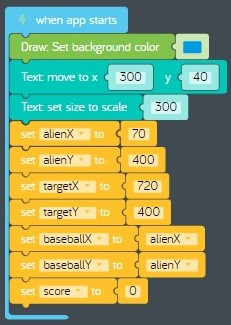  
    **figure 08-010** Completed setup code
1. Next we need to start writing the code that redraws the screen each frame. We will draw five different shapes. Three of the shapes stay in the same place all the time (smiley sun, grassy hill, alien), and two of the shapes will move as we play our game (baseball and target). We will also update the score each time we draw a fresh frame.
    1. Drag a new *when app starts* event code block from the *App* tray onto the code space to help keep our code organized.
    1. Drag a new *every do* loop code block from *Control* tray and attach it inside the previous code block. Change "seconds" to "frames".
    1. Find the *clear drawing* code block from the *Draw* tray and attach it inside the previous code block.  
      
    **figure** *clear drawing* code block from the *Draw* tray
    1. Draw the following shapes inside the *every do* loop using the information in this table:
        Shape | Fill colour | x position | y position
        --- | --- | --- | ---
        Ellipse | Green | 400 | 500
        Stamp ("Sun smiling" size 100) | None | 70 | 100
        Stamp ("Alien" size 100) | None | alienX | alienY
        Circle (radius 80) | Red | targetX | targetY
        Circle (radius 50) | White | targetX | targetY
        Circle (radius 30) | Red | targetX | targetY
        Circle (radius 10) | White | targetX | targetY
        Stamp ("Baseball" size 25) | None | baseballX | baseballY
    1. Drag a new *value* code block from the *Text* part tray and connect it to the previous code block. Set the value to the variable *score*.
    1. Verify that your drawing code looks like this:  
    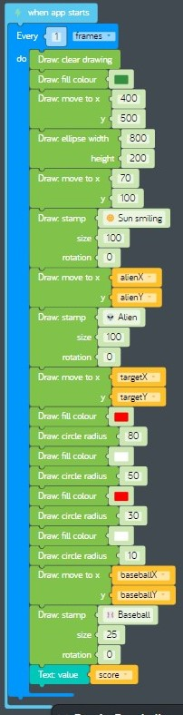  
    **figure 08-020** Completed drawing code
1. Next let's get the target moving up and down. This code will change the variables that control where the target gets drawn each frame. When the target reaches the top or bottom of the canvas it needs to change directions. Each time the target changes direction the speed should change to make the game more challenging.
    1. Drag a new *when app starts* event code block from the *App* tray onto the code space to help keep our code organized.
    1. Drag a new *set variable* code block from the *Variables* tray and connect it inside the previous code block. Create a new variable named "targetSpeedY" and initialize it to -5. This will make the target start moving up five pixels at a time when our program starts.
    1. Drag a new *every do* loop code block from *Control* tray and attach it to the previous code block. Change "seconds" to "frames".
    1. Drag a new *increment variable* code block from the *Math* tray and attach it to the inside of the new *every do* loop. Set the variable to "targetY", leave the increment set to "+=" and set the value to "targetSpeedY". This will move the target by "targetSpeedY" pixels each frame.
    1. Now we need to change the direction and play a sound whenever the target hits the bottom of the canvas.
        1. Drag a new *if do* code block from the *Logic* tray and attach it to the bottom of the previous code block. Set the condition to "targetY" > 520.
        1. When the target hits the bottom of the canvas it is moving in a positive direction on the y axis, so we need to change the direction by changing "targetSpeedY" to a random negative number between -10 and -1 pixels.
            1. Drag a new *set variable* code block from the *Variables* tray and attach it to the inside of the *if do* code block. Change the variable to "targetY".
            1. Find the *random number* code block in the *Math* tray.  
            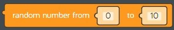  
            **figure 00-040-040** *random number* code block from the *Math* tray.
            1. Drag a new *random number* code block from the *Math* tray and connect it to the right of the previous code block. Set the first number to -10 and the second number to -1.
            1. Find the *Speaker* part in *Add Parts* and add a new *Speaker*.  
            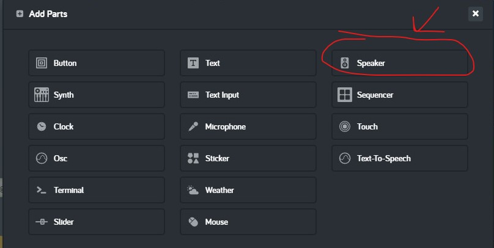  
            **figure 00-500-300** *Speaker* part in *Add Parts*
            1. Find the *play* code block in the *Speaker* tray.  
            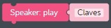  
            **figure 00-500-310**
            1. Drag a new *play* code block from the *Speaker* tray and connect it to the bottom of the previous code block. Change "Claves" to "Twip*.
    1. Now we need to change the direction and play a sound whenever the target hits the top of the canvas.
        1. Drag a new *if do* code block from the *Logic* tray and attach it to the bottom of the previous *if do* block. Set the condition to "targetY" < 80.
        1. When the target hits the top of the canvas it is moving in a negative direction on the y axis, so we need to change the direction by changing "targetSpeedY" to a random positive number between 1 and 10 pixels.
            1. Drag a new *set variable* code block from the *Variables* tray and attach it to the inside of the *if do* code block. Change the variable to "targetY".
            1. Drag a new *random number* code block from the *Math* tray and connect it to the right of the previous code block. Set the first number to 1 and the second number to 10.
            1. Drag a new *play* code block from the *Speaker* tray and connect it to the bottom of the previous code block. Change "Claves" to "Twip*.
    1. Verify that your target moving code looks like this:  
    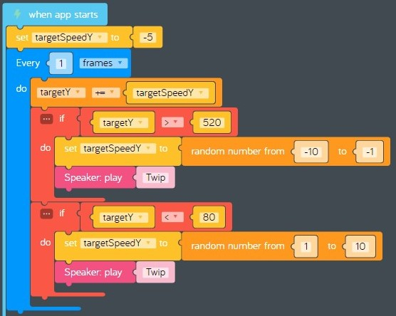  
    **figure 08-030** Completed target moving code
1. Now let's test your code. Does the target move up and down in the y axis? Do you hear the "Twip" sound when it hits the top or the bottom of the canvas? Does the target move at different speeds when it changes directions? Now would be a good time to take a break and come back later to continue working on the hands on exercise. Save your progress using *Menu* > *Save*. This will save a copy of your code as a text file in the *Downloads* folder.
1. Welcome back! Next let's add some code to draw a cross hair to mark where the alien will toss the baseball.
    1. Drag a new *when app starts* event code block from the *App* tray onto the code space to help keep our code organized.
    1. Create the following variables and initialize them using the information in this table:  
        Variable Name | Initial Value
        --- | ---
        crosshairX | 400
        crosshairY | 300
        throwInProgress | 0
    1. Verify that your code looks like this:  
    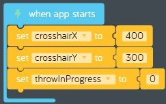  
    **figure 08-040** Completed *when app starts* code
    1. Find the *every 1 frames* code block used to draw shapes on the canvas.
    1. Drag a new *move to* code block from the *Draw* tray and connect it to the bottom of the *text: value score* code block. Set the x value to "crosshairX" and the y value to "crosshairY".
    1. Find the *stroke colour* code block in the *Draw* tray.  
    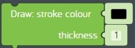  
    **figure 00-080-060** *stroke colour* code block from the *Draw* tray
    1. Draw a new *stroke colour* code block from the *Draw* tray and connect it to the previous block.
    1. Find the *line along* code block in the *Draw* tray.  
    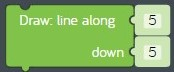  
    **figure 00-080-100** *line along* code block from the *Draw* tray
    1. Draw four line segments using the *line along* code block using the following settings:  
        along (x) | down (y)
        :-: | :-:
        0 | -20
        0 | 20
        -20 | 0
        20 | 0
    1. Verify your code looks like this:  
    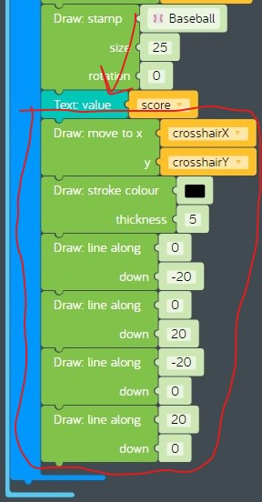  
    **figure 08-050** Completed code to draw cross hair
1. Now let's get the cross hair to move when the mouse is over the canvas.
    1. Add a new *Mouse* part from *Add Parts*.
    1. Find the *on move* event code block in the *Moue* tray.  
      
    **figure 00-500-295** *on move* event code block from the *Mouse* tray
    1. Drag a new *on move* event code block from the *Mouse tray* onto the code space. The code inside this block will run whenever the mouse is moving over the canvas. We only want the cross hair to move when the ball is not being thrown.
        1. Drag a new *if do* code block from the *Logic* tray and connect it to the inside of the new *on move* code block.
        1. Find the *not* code block in the *Logic* tray.  
        [00-030-050](../images/00-030-050.logic.not.jpg)  
        **figure 00-030-050** *not* code block from the *Logic* tray
        1. Drag a new *not* code block from the *Logic* and attach it to the right of the new *if do* code block.
        1. Drag a new *set variable* code block from the *Variables* tray and attach it to the right of the new *not* code block. Change "item" to "throwInProgress". When "throwInProgress" is set to 0, this means "false", and when "throwInProgress" is set to 1 this means "true". So the code in the *if do* block will only run when there is no throw in progress. A variable used in true/false conditions is known as a "boolean" variable.
        1. To make the mouse move we need to change the x and y coordinates for where the cross hair gets drawn each frame to the current coordinates of the mouse.
            1. Find the *mouse x* and *mouse y* code blocks in the *Mouse* tray.  
              
            **figure 00-500-210** *mouse x* code block in the *Mouse* tray.  
            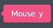  
            **figure 00-500-220** *mouse y* code block in the *Mouse* tray.
            1. Add two *set variable* code blocks to the inside of the *if do* code block and set them to the following values:  
                Variable | value
                --- | ---
                crosshairX | *mouse x*
                crosshairY | *mouse y*
    1. Verify that the completed *Mouse: on move* code block looks like this:  
    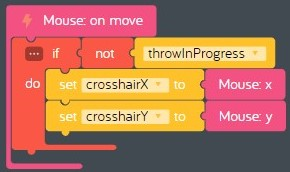  
    **figure 08-060** Completed *Mouse: on move* code block
1. Next let's write some code to mark where the alien will toss the baseball using the cross hair. We could mark the location using a mouse click, but we need to save that kind of event for a different use that we'll explain later. Instead we will use the location where the mouse button is released to mark the spot using the cross hair. Once we've marked the spot we will signal that the ball should be tossed by setting the "throwInProgress" variable to 1. Remember 1 is the same as "true" when you are using a boolean variable.
    1. Find the *on release* event code block in the *Mouse* tray.  
    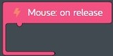  
    **figure 00-500-290** *on release* code block from the *Mouse* tray
    1. Drag a new *on release* event code block from the *Mouse tray* onto the code space. The code in this code block will run when the mouse button is released *after* it's been clicked.
        1. Add three *set variable* code blocks to the inside of the *Mouse: on release* code block and set them to the following values:  
            Variable | value
            --- | ---
            crosshairX | *mouse x*
            crosshairY | *mouse y*
            throwInProgress | 1
        1. Drag a new *play* code block from the *Speaker* tray and change the sound to "Swash".
    1. Verify that the completed *Mouse: on release* code looks like this:  
    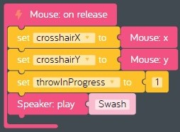  
    **figure 08-070** Completed *Mouse: on release* code block.
1. Now test your code by moving the mouse around on the canvas and clicking on the canvas. Do you hear the "Swash" sound? Did the cross hair stick to the spot where you released the mouse button? Use the *restart* button to restart your program so you can test it multiple times. Now would be a good time to take a break and come back later to continue working on the hands on exercise. Don't forget to save your progress.
1. **Welcome back!** Do you remember the code we wrote to set the location where the alien tosses the baseball? We used the *Mouse: on release* code block instead of  *Mouse: on click*. So what were we saving the *Mouse: on click* event for? Wouldn't it be cool if we could add some code that allows the player to throw the ball at different speeds?  
**Calculating force:** We will use the amount of time the mouse button is held down to control how much force the alien uses when tossing the baseball. To do this we will need to calculate how long the mouse button was held down, then convert that into a force percentage. 10% would be a very slow toss because the alien only uses a little force, while 100% would be a super fast toss because the alien use a lot of force.  
Let's assume a single click of the mouse without holding it down before it is released is 10% force, while a long click of the mouse where the player holds it down for up to 3 seconds is 100% force.  
**Pseudo code:** We are going to need to use some math to translate the time the mouse was held down into the force percentage. We could jump write in and start writing code, but sometimes it helps to work out the math in advance before you start coding. This process is called "writing pseudo code".  
