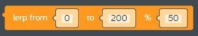
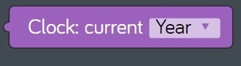

# Lesson 08 - games and sound

In this lesson we'll cover some new topics:

* [PC game](https://en.wikipedia.org/wiki/PC_game)
* [Digital audio](https://en.wikipedia.org/wiki/Digital_audio)

## Review

In the previous lesson, we made some improvements to our *baseball toss* program by adding code to make the alien toss baseballs to different places on the canvas. To do this we used two new concepts:

* [Events](https://en.wikipedia.org/wiki/Event-driven_programming)
  * *Mouse* code blocks
    * *on click*  
      
    **figure 00-500-280** *on click* event code block from the *Mouse* tray
* [Linear interpolation](https://en.wikipedia.org/wiki/Linear_interpolation) more commonly known as *lerp*
  * *Math* code blocks
    * *lerp*  
      
    **figure 00-040-050** *lerp* code block from the *Math* tray

## Challenges

Before we start coding, we need to complete eight challenges. You don't have to complete them all right now, take your time. You will need to remember things from these challenges to complete the hands on exercise.

* [Challenges > Making a Pong Game > Making a Pong Game](https://code.kano.me/challenge/CLUB09/CLUB09_06_pong)
* [Challenges > Making a Pong Game > Setting Up](https://code.kano.me/challenge/CLUB09/CLUB09_01_pong)
* [Challenges > Making a Pong Game > Getting the Ball Rolling](https://code.kano.me/challenge/CLUB09/CLUB09_02_pong)
* [Challenges > Making a Pong Game > Hitting the Ball](https://code.kano.me/challenge/CLUB09/CLUB09_03_pong)
* [Challenges > Making a Pong Game > Coding Recap](https://code.kano.me/challenge/CLUB09/CLUB09_07_pong)
* [Challenges > Making a Pong Game > Making the AI](https://code.kano.me/challenge/CLUB09/CLUB09_04_pong)
* [Challenges > Making a Pong Game > Finishing the Game](https://code.kano.me/challenge/CLUB09/CLUB09_05_pong)
* [Challenges > Making a Pong Game > Coding Recap and Remixing](https://code.kano.me/challenge/CLUB09/CLUB09_08_pong)

## Hands on

In this hands on exercise we will to turn our *baseball toss* sample into a [PC game](https://en.wikipedia.org/wiki/PC_game). We will add a moving target that the alien will try to hit to score points. We'll also add some [digital audio](https://en.wikipedia.org/wiki/Digital_audio) to make sounds when the baseball is tossed and when the target is hit.  

Here's a list of steps you need to complete during this hands on exercise, check them off as you go so you can track your progress. Each of these steps can take up to 30 minutes to finish so take your time and have fun experimenting with the program as you go. It's okay to save your work and come back to finish it later.

* [ ] Redraw shapes on the canvas each frame
* [ ] Add a moving target
* [ ] Add a cross hair
* [ ] Calculate click duration

1. Start with an empty code space that has a *when app starts* code block. We will use it to put some of our setup code.
    1. Set the background color to blue.
    1. Add a new *Text* part. Move it to x = 300, y = 40. Make it bigger by setting the scale to 300.
    1. Create the following variables and initialize them using the information in this table:  
        Variable Name | Initial Value
        --- | ---
        alienX | 70
        alienY | 400
        targetX | 720
        targetY | 400
        baseballX | alienX
        baseballY | alienY
        score | 0
    1. Verify that your code looks like this:  
      
    **figure 08-010** Completed setup code
1. Next we need to start writing the code that redraws the screen each frame. We will draw five different shapes. Three of the shapes stay in the same place all the time (smiley sun, grassy hill, alien), and two of the shapes will move as we play our game (baseball and target). We will also update the score each time we draw a fresh frame.
    1. Drag a new *when app starts* event code block from the *App* tray onto the code space to help keep our code organized.
    1. Drag a new *every do* loop code block from *Control* tray and attach it inside the previous code block. Change "seconds" to "frames".
    1. Find the *clear drawing* code block from the *Draw* tray and attach it inside the previous code block.  
      
    **figure** *clear drawing* code block from the *Draw* tray
    1. Draw the following shapes inside the *every do* loop using the information in this table:
        Shape | Fill colour | x position | y position
        --- | --- | --- | ---
        Ellipse | Green | 400 | 500
        Stamp ("Sun smiling" size 100) | None | 70 | 100
        Stamp ("Alien" size 100) | None | alienX | alienY
        Circle (radius 80) | Red | targetX | targetY
        Circle (radius 50) | White | targetX | targetY
        Circle (radius 30) | Red | targetX | targetY
        Circle (radius 10) | White | targetX | targetY
        Stamp ("Baseball" size 25) | None | baseballX | baseballY
    1. Drag a new *value* code block from the *Text* part tray and connect it to the previous code block. Set the value to the variable *score*.
    1. Verify that your drawing code looks like this:  
      
    **figure 08-020** Completed drawing code
1. **Test your program:** Is the smiley sun in the upper-left? Is the alien in the lower-left? Is the target in the lower-right? Do the circles you drew look like a target? Is a score of 0 shown at the top?  
**Track your progress:** If every thing looks good, go ahead and check off the *Redraw shapes on the canvas each frame* step.  
**Save your program:** Now would be a good time to take a break and come back later to continue working on the hands on exercise. Save your program by clicking on *Menu* > *Save*. This will save a copy of your code as a text file in the *Downloads* folder on your PC. See [baseball-toss-game-remix-01.kcode](./baseball-toss-game-remix-01.kcode) if you can't find your program later.
1. *Welcome back!* Next let's get the target moving up and down. This code will change the variables that control where the target gets drawn each frame. When the target reaches the top or bottom of the canvas it needs to change directions. Each time the target changes direction the speed should change to make the game more challenging.
    1. Drag a new *when app starts* event code block from the *App* tray onto the code space to help keep our code organized.
    1. Drag a new *set variable* code block from the *Variables* tray and connect it inside the previous code block. Create a new variable named "targetSpeedY" and initialize it to -5. This will make the target start moving up five pixels at a time when our program starts.
    1. Drag a new *every do* loop code block from *Control* tray and attach it to the previous code block. Change "seconds" to "frames".
    1. Drag a new *increment variable* code block from the *Math* tray and attach it to the inside of the new *every do* loop. Set the variable to "targetY", leave the increment set to "+=" and set the value to "targetSpeedY". This will move the target by "targetSpeedY" pixels each frame.
    1. Now we need to change the direction and play a sound whenever the target hits the bottom of the canvas.
        1. Drag a new *if do* code block from the *Logic* tray and attach it to the bottom of the previous code block. Set the condition to "targetY" > 520.
        1. When the target hits the bottom of the canvas it is moving in a positive direction on the y axis, so we need to change the direction by changing "targetSpeedY" to a random negative number between -10 and -1 pixels.
            1. Drag a new *set variable* code block from the *Variables* tray and attach it to the inside of the *if do* code block. Change the variable to "targetY".
            1. Find the *random number* code block in the *Math* tray.  
              
            **figure 00-040-040** *random number* code block from the *Math* tray.
            1. Drag a new *random number* code block from the *Math* tray and connect it to the right of the previous code block. Set the first number to -10 and the second number to -1.
            1. Find the *Speaker* part in *Add Parts* and add a new *Speaker*.  
              
            **figure 00-500-300** *Speaker* part in *Add Parts*
            1. Find the *play* code block in the *Speaker* tray.  
              
            **figure 00-500-310**
            1. Drag a new *play* code block from the *Speaker* tray and connect it to the bottom of the previous code block. Change "Claves" to "Twip*.
    1. Now we need to change the direction and play a sound whenever the target hits the top of the canvas.
        1. Drag a new *if do* code block from the *Logic* tray and attach it to the bottom of the previous *if do* block. Set the condition to "targetY" < 80.
        1. When the target hits the top of the canvas it is moving in a negative direction on the y axis, so we need to change the direction by changing "targetSpeedY" to a random positive number between 1 and 10 pixels.
            1. Drag a new *set variable* code block from the *Variables* tray and attach it to the inside of the *if do* code block. Change the variable to "targetY".
            1. Drag a new *random number* code block from the *Math* tray and connect it to the right of the previous code block. Set the first number to 1 and the second number to 10.
            1. Drag a new *play* code block from the *Speaker* tray and connect it to the bottom of the previous code block. Change "Claves" to "Twip*.
    1. Verify that your target moving code looks like this:  
      
    **figure 08-030** Completed target moving code
1. **Test your program:** Does the target move up and down in the y axis? Do you hear the "Twip" sound when it hits the top or the bottom of the canvas? Does the target move at different speeds when it changes directions?  
**Track your progress:** If every thing looks good, go ahead and check off the *Add a moving target* step.  
**Save your program:** Now would be a good time to take a break and come back later to continue working on the hands on exercise. Save your program by clicking on *Menu* > *Save*. See [baseball-toss-game-remix-02.kcode](./baseball-toss-game-remix-02.kcode) if you can't find your program later.
1. Welcome back! Next let's add some code to draw a cross hair to mark where the alien will toss the baseball.
    1. Drag a new *when app starts* event code block from the *App* tray onto the code space to help keep our code organized.
    1. Create the following variables and initialize them using the information in this table:  
        Variable Name | Initial Value
        --- | ---
        crosshairX | 400
        crosshairY | 300
        throwInProgress | 0
    1. Verify that your code looks like this:  
      
    **figure 08-040** Completed *when app starts* code
    1. Find the *every 1 frames* code block used to draw shapes on the canvas.
    1. Drag a new *move to* code block from the *Draw* tray and connect it to the bottom of the *text: value score* code block. Set the x value to "crosshairX" and the y value to "crosshairY".
    1. Find the *stroke colour* code block in the *Draw* tray.  
      
    **figure 00-080-060** *stroke colour* code block from the *Draw* tray
    1. Draw a new *stroke colour* code block from the *Draw* tray and connect it to the previous block.
    1. Find the *line along* code block in the *Draw* tray.  
      
    **figure 00-080-100** *line along* code block from the *Draw* tray
    1. Draw four line segments using the *line along* code block using the following settings:  
        along (x) | down (y)
        :-: | :-:
        0 | -20
        0 | 20
        -20 | 0
        20 | 0
    1. Verify your code looks like this:  
      
    **figure 08-050** Completed code to draw cross hair
1. Now let's get the cross hair to move when the mouse is over the canvas.
    1. Add a new *Mouse* part from *Add Parts*.
    1. Find the *on move* event code block in the *Moue* tray.  
      
    **figure 00-500-295** *on move* event code block from the *Mouse* tray
    1. Drag a new *on move* event code block from the *Mouse tray* onto the code space. The code inside this block will run whenever the mouse is moving over the canvas. We only want the cross hair to move when the ball is not being thrown.
        1. Drag a new *if do* code block from the *Logic* tray and connect it to the inside of the new *on move* code block.
        1. Find the *not* code block in the *Logic* tray.  
        [00-030-050](../images/00-030-050.logic.not.jpg)  
        **figure 00-030-050** *not* code block from the *Logic* tray
        1. Drag a new *not* code block from the *Logic* and attach it to the right of the new *if do* code block.
        1. Drag a new *set variable* code block from the *Variables* tray and attach it to the right of the new *not* code block. Change "item" to "throwInProgress". When "throwInProgress" is set to 0, this means "false", and when "throwInProgress" is set to 1 this means "true". So the code in the *if do* block will only run when there is no throw in progress. A variable used in true/false conditions is known as a "boolean" variable.
        1. To make the mouse move we need to change the x and y coordinates for where the cross hair gets drawn each frame to the current coordinates of the mouse.
            1. Find the *mouse x* and *mouse y* code blocks in the *Mouse* tray.  
              
            **figure 00-500-210** *mouse x* code block in the *Mouse* tray.  
              
            **figure 00-500-220** *mouse y* code block in the *Mouse* tray.
            1. Add two *set variable* code blocks to the inside of the *if do* code block and set them to the following values:  
                Variable | value
                --- | ---
                crosshairX | *mouse x*
                crosshairY | *mouse y*
    1. Verify that the completed *Mouse: on move* code block looks like this:  
      
    **figure 08-060** Completed *Mouse: on move* code block
1. Next let's write some code to mark where the alien will toss the baseball using the cross hair. We could mark the location using a mouse click, but we need to save that kind of event for a different use that we'll explain later. Instead we will use the location where the mouse button is released to mark the spot using the cross hair. Once we've marked the spot we will signal that the ball should be tossed by setting the "throwInProgress" variable to 1. Remember 1 is the same as "true" when you are using a boolean variable.
    1. Find the *on release* event code block in the *Mouse* tray.  
      
    **figure 00-500-290** *on release* code block from the *Mouse* tray
    1. Drag a new *on release* event code block from the *Mouse tray* onto the code space. The code in this code block will run when the mouse button is released *after* it's been clicked.
        1. Add three *set variable* code blocks to the inside of the *Mouse: on release* code block and set them to the following values:  
            Variable | value
            --- | ---
            crosshairX | *mouse x*
            crosshairY | *mouse y*
            throwInProgress | 1
        1. Drag a new *play* code block from the *Speaker* tray and change the sound to "Swash".
    1. Verify that the completed *Mouse: on release* code looks like this:  
      
    **figure 08-070** Completed *Mouse: on release* code block.
1. **Test your program:** Move the mouse around on the canvas and click on the canvas. Do you hear the "Swash" sound? Did the cross hair stick to the spot where you released the mouse button? Use the *restart* button so you can test your program multiple times.  
**Track your progress:** If everything looks good, go ahead and check off the *Add a cross hair* step.  
**Save your program:** Now would be a good time to take a break and come back later to continue working on the hands on exercise. Save your program by clicking on *Menu* > *Save*. See [baseball-toss-game-remix-03.kcode](./baseball-toss-game-remix-03.kcode) if you can't find your program later.
1. Welcome back! Let's add some code that allows the player to throw the ball at different speeds.  
    1. Before we start coding, let's make a plan.  
        1. **Calculating force:** Let's use the amount of time the player holds down the mouse button to control how hard the alien throws the baseball. To do this we will need to calculate how long the mouse button was held down, then convert the length of time into a percentage. For example, 10% would be a very slow toss because the alien only uses a little force, while 100% would be a super fast throw because the alien use a lot of force. Let's assume a fast click of the mouse without holding the mouse button down is 10% force (a slow toss), while a long click of the mouse where the player holds the mouse button down for up to 3 seconds is 100% force (a fast toss).  
        1. **Pseudo code:** We are going to need to use some math to translate the time the mouse was held down into a percentage. We could jump write in and start writing code, but sometimes it helps to work out the code in advance before you start coding. This process is called "writing pseudo code".  
        1. **Timestamp calculation:** First, we need a way to record when the mouse button was clicked (*on click* event), and when the mouse button was released (*on release* event). Programming languages are like a tool box. Some programming languages, like *Kano Code* provide a few simple tools. Others, like *JavaScript* have every tool you could imagine, some of which you may never use. Many programming languages have a tool for what we need called a *timestamp*, which is a number that represents a specific moment in time. It's perfect for recording when an event happened. Unfortunately *Kano Code* doesn't have a *timestamp* code block so we will have to make our own.  Using a digital clock we can measure the current time down to the milliseconds. When you check the time on a digital clock it looks like this: `HH:MM:SS.000`. Here's what each of the time parts mean:  
            Time Part | What it Means | Range | Notes
            :-: | :-: | :-: | ---
            HH | Hour | 0 - 23 | There are 24 hours in a day, hour 0 is just after midnight but before 1 in the morning)
            MM | Minute | 0 - 59 | There are 60 minutes in an hour.
            SS | Seconds | 0 - 59 | There are 60 seconds in a minute.
            000 | Milliseconds | 0 - 999 | There are 1,000,000 milliseconds in a second, but those are a lot of digits, so digital clocks convert milliseconds into thousandths of a second to make the time more readable.  
        1. **Timestamp example:** We can get all of these time part values using the a using a *Clock* part in *Kano Code*, but then we will need to combine them into a single number to make our *timestamp*. Since the digital clock converts milliseconds into thousandths of a second, we will need to convert everything to seconds then add them together to get our timestamp number.  Let's say the player clicks the mouse at exactly `12:02:10.730`, here's how to calculate the *timestamp* number:  
            Time Part | Value | Convert to Seconds           |     | Value in Seconds
            :-:       | :-:   | :-:                          | --: | --:
            HH        | 12    | 12 x 60 minutes x 60 seconds |     | 43,200.000
            MM        | 02    | 2 x 60 seconds               | +   | 120.000
            SS        | 10    | 10                           | +   | 10.000
            000       | 730   | 730 ÷ 1,000                  | +   | 0.730
            Timestamp |       |                              | =   | 43,330.730  
        1. **Calculating duration using timestamps:** Now that we have a way of recording a specific moment in time using a timestamp, we have a way to measure the length of time between two events. Here's the math for calculating how many seconds the player held down the mouse button:
        `durationSeconds = mouseReleaseTimestamp - mouseClickTimestamp`
        1. **Timestamp midnight bug:** This code will work great except for one thing, can you guess? What happens at midnight when the time rolls over from `23:59:59.999` to `00:00:00.000`into the next day? It is very unlikely that this will happen, the player would have to click the mouse just before midnight and release the mouse just after midnight, and most players should be in bed by then. If we didn't handle this in our code it would be a *bug*. Since this will probably never happen, we will fix this bug by restarting our program if this happens so our game doesn't do anything strange. Don't tell anybody we cheated!  
        `if (mouseReleaseTimestamp < mouseClickTimestamp) then restart program`  
    1. Okay now that we have a plan let's write the code.
        1. Drag a new *when app starts* event code block from the *App* tray into the code space. We keep adding new ones so we can keep the code for each section separate. This makes it easier to *debug* our program.
        1. Create and initialize 7 new variables inside the previous code block:  
            Variable | Initial Value
            --- | ---
            hourNow | 0
            minuteNow | 0
            secondsNow | 0
            millisecondsNow | 0
            timestampNow | 0
            mouseClickTimestamp | 0
            mouseReleaseTimestamp | 0
            clickDurationSeconds | 0
        1. Verify your code looks like this:  
              
            **figure 08-080** Completed *when app starts* code block
        1. Next let's add the code to calculate "mouseClickTimestamp".
            1. Drag a new *on click* event code block from the *Mouse* tray and place it near the other mouse events on your code space.
            1. Locate the *Clock* part in *Add Parts*.
                
                **figure 00-500-400** *Clock* part from *Add Parts*
            1. Attach a new *set variable* code block inside the new *mouse: on click* event code block and use it to reset "timestampNow" to 0.
            1. Attach a new *set variable* code block to the previous code block and change the variable from "item" to "hourNow".
            1. Attach a new *arithmetic* code bock from the *Math* tray and attach it to the right of the previous code block. Change the arithmetic operator from "add" to "multiply".
            1. Add a new *Clock* part from *Add Parts*.
            1. Locate the *Clock current: Year* code block in the *Clock* tray.  
                  
                **figure 00-500-410** *Clock current: Year* code block in the *Clock* tray.
            1. Drag a new *Clock current: Year* code part from the *Clock* tray and connect it into the first slot of the arithmetic code block. Change "Year" to "Hour".
            1. Drag a new *arithmetic* code block from the *Math* tray and connect it to the second slot of the previous code block. Change the first number to 60, change the arithmetic operator from "add" to "to the power of". Change the second number to 2.
            1. This converts the current hour into seconds, and uses *exponentiation* to simplify the formula. Instead of having to code `currentHour x 60 x 60` we just used the formula `currentHour x 60^2`. Verify your code looks like this:  
                  
                **figure 08-090** Completed hours to seconds calculation
            1. Attach a new *set variable* code block to the previous code block and change th3e variable from "item" to "minuteNow".
            1. Drag a new *arithmetic* code bock from the *Math* tray and connect it to the right of the previous code block. Change the arithmetic operator from "add" to "multiply".
            1. Drag a new *Clock current: Year* code block from the *Clock* tray and connect it to the first slot of the previous code block. Change "Year" to "Minute".
            1. Change the number in the second slot of the *arithmetic* code block from 0 to 60. Verify your code looks like this:  
                  
                **figure 08-100** Completed minutes to seconds calculation
            1. Attach a new *set variable* code block to the previous code block and change th3e variable from "item" to "secondsNow".
            1. Drag a new *Clock current: Year* code block from the *Clock* tray and connect it to the right of the previous code block. Change "Year" to "Seconds".
            1. Attach a new *set variable* code block to the previous code block and change th3e variable from "item" to "millisecondsNow".
            1. Drag a new *arithmetic* code bock from the *Math* tray and connect it to the right of the previous code block. Change the arithmetic operator from "add" to "divide".
            1. Drag a new *Clock current: Year* code block from the *Clock* tray and connect it to the first slot of the previous code block. Change "Year" to "Milliseconds".
            1. Change the number in the second slot of the *arithmetic* code block from 0 to 1000. Verify your code looks like this:  
                  
                **figure 08-110** Completed milliseconds to seconds calculation
            1. Now it's time to add everything up and store the total in "timeStampNow". Use the *increment variable* code block from the *Math* tray to add "hourNow", "minuteHow", "secondsNow" and "millisecondsNow" to "timestampNow". Your completed code should look like this:  
                  
                **figure 08-120** Completed code to add up timestampNow
            1. Attach a new *set variable* code block to the previous code block and change th3e variable from "item" to "mouseClickTimestamp". Set the value to "timestampNow". Your completed code should look like this:  
                
                **figure 08-130** Completed code to calculate "mouseClickTimestamp"
            1. But wait, we are only half done, we have to do all of the same calculations for "mouseReleaseTimestamp" right? Because of the way we have written the code, we can re-use most of the code we just wrote for this. Good programmers write *re-usable code*.
                1. Using the *Kano Code* "Duplicate" feature, make a copy of all the code blocks you wrote in the previous section and attach them to the last code block in the *Mouse: on release* code block.
                1. Change the last *set variable* code block you copied from "mouseClickTimestamp" to "mouseReleaseTimestamp". Your completed code should look like this:  
                
                **figure 08-140** Completed *Mouse: on release* code block
            1. Now let's add the final calculation which will record how many seconds the player held the mouse button down. Let's also take care of the *timestamp midnight bug* we talked about earlier.
                1. Drag a new *if do else* code block from the *Logic* tray and connect it to the last code bock in the *Mouse: on release* event code block.
                1. Drag a new *compare* code block from the *Logic* tray and connect it to the right if the previous *if* code block. Set the first slot of the condition to "mouseReleaseTimestamp", set the condition to "greater than", and set the second slot of the condition to "mouseClickTimestamp".
                1. Drag a new *set variable* code block from the *Variables* tray and connect inside the *if* portion of the *if do else* code block. Set the variable to "clickDurationSeconds".
                1. Drag a new *arithmetic* code block from the *Math* tray and connect it to the right of the previous code block. Set the first slot to "mouseReleaseTimestamp", set the operator to "subtract", and set the second slot to "mouseClickTimestamp".
                1. If the *else* portion of this statement runs, that means that "mouseClickTimestamp" is greater than "mouseReleaseTimestamp", which means that the player clicked the mouse button just before midnight, and released it just after midnight. We decided to handle this situation by restarting our program. 1. Find the *restart code* code block in the *Control* tray.  
                  
                **figure 00-020-050** *restart code* code block in the *Control* tray
                1. Drag a new *restart code* code block from the *Control* tray and connect it inside the *else* portion of the *if do else* code block.
                1. Verify your completed code looks like this:  
                  
                **figure 08-150** Completed "clickDurationSeconds" calculation with bug handling code
        1. Now let's display the length of time in seconds that the player held down the mouse button.
            1. Add a new *Text* part from *Add Parts*. Since you already have a text part this one will be called "Text 2".
            1. Find the *when app starts* event code block you added for this section.
            1. Drag a new *move to* code block from the *Text 2* tray and attach it to the last code bock in the *when app starts* code block. Set the x value to 400 and the y value to 550. Your completed code should look like this:  
              
            **figure 08-160** Completed *when app starts* event code block
            1. Find the *every 1 frames* code block used to redraw shapes on the canvas.
            1. Drag a new *value* code block from the *Text 2* tray and attach it to the last code block in the *every 1 frames* loop. Set the value to "clickDurationSeconds". Your completed code should look like this:  
              
            **figure 08-170** Completed *every 1 frames* loop code block
    1. **Test your program:** Restart your program, then click the mouse button on the canvas and hold it down for 3 seconds before you release it. The number on the bottom of the screen shows how many seconds you held down the mouse button. Try it a few times by restarting your program and holding the mouse button down for different lengths of time.  
    **Track your progress:** If every thing looks good, go ahead and check off the *Calculate click duration* step.  
    **Save your program:** Now would be a good time to take a break and come back later to continue working on the hands on exercise. Save your program by clicking on *Menu* > *Save*. See [baseball-toss-game-remix-02.kcode](./baseball-toss-game-remix-02.kcode) if you can't find your program later.
