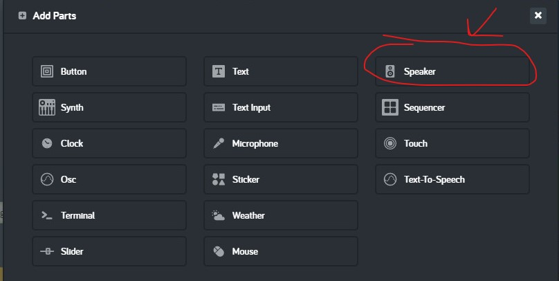

# Lesson 08 - games and sound

## Hands on

In this hands on exercise we will to turn our *baseball toss* sample into a [PC game](https://en.wikipedia.org/wiki/PC_game). We will use [AI](https://en.wikipedia.org/wiki/Artificial_intelligence) to add a moving target that the alien will try to hit to score points. We'll also add some [digital audio](https://en.wikipedia.org/wiki/Digital_audio) to make sounds when the baseball is tossed and when the target is hit.

1. Start with an empty code space that has a *when app starts* code block. We will use it to put some of our setup code.
    1. Set the background color to blue.
    1. Add a new *Text* part. Move it to x = 300, y = 40. Make it bigger by setting the scale to 300.
    1. Create the following variables and initialize them using the information in this table:  

        Variable Name | Initial Value
        --- | ---
        alienX | 70
        alienY | 400
        targetX | 720
        targetY | 400
        baseballX | alienX
        baseballY | alienY
        score | 0
    1. Verify that your code looks like this:  
      
    **figure 08-010** Completed setup code
1. Next we need to start writing the code that redraws the screen each frame. We will draw five different shapes. Three of the shapes stay in the same place all the time (smiley sun, grassy hill, alien), and two of the shapes will move as we play our game (baseball and target). We will also update the score each time we draw a fresh frame.
    1. Drag a new *when app starts* event code block from the *App* tray onto the code space to help keep our code organized.
    1. Drag a new *every do* loop code block from *Control* tray and attach it inside the previous code block. Change "seconds" to "frames".
    1. Find the *clear drawing* code block from the *Draw* tray and attach it inside the previous code block.  
      
    **figure** *clear drawing* code block from the *Draw* tray
    1. Draw the following shapes inside the *every do* loop using the information in this table:

        Shape | Fill colour | x position | y position
        --- | --- | --- | ---
        Ellipse | Green | 400 | 500
        Stamp ("Sun smiling" size 100) | None | 70 | 100
        Stamp ("Alien" size 100) | None | alienX | alienY
        Circle (radius 80) | Red | targetX | targetY
        Circle (radius 50) | White | targetX | targetY
        Circle (radius 30) | Red | targetX | targetY
        Circle (radius 10) | White | targetX | targetY
        Stamp ("Baseball" size 25) | None | baseballX | baseballY
    1. Drag a new *value* code block from the *Text* part tray and connect it to the previous code block. Set the value to the variable *score*.
    1. Verify that your drawing code looks like this:  
      
    **figure 08-020** Completed drawing code
1. Next let's get the target moving up and down. This code will change the variables that control where the target gets drawn each frame. When the target reaches the top or bottom of the canvas it needs to change directions. Each time the target changes direction the speed should change to make the game more challenging.
    1. Drag a new *when app starts* event code block from the *App* tray onto the code space to help keep our code organized.
    1. Drag a new *set variable* code block from the *Variables* tray and connect it inside the previous code block. Create a new variable named "targetSpeedY" and initialize it to -5. This will make the target start moving up five pixels at a time when our program starts.
    1. Drag a new *every do* loop code block from *Control* tray and attach it to the previous code block. Change "seconds" to "frames".
    1. Drag a new *increment variable* code block from the *Math* tray and attach it to the inside of the new *every do* loop. Set the variable to "targetY", leave the increment set to "+=" and set the value to "targetSpeedY". This will move the target by "targetSpeedY" pixels each frame.
    1. Now we need to change the direction and play a sound whenever the target hits the bottom of the canvas.
        1. Drag a new *if do* code block from the *Logic* tray and attach it to the bottom of the previous code block. Set the condition to "targetY" > 520.
        1. When the target hits the bottom of the canvas it is moving in a positive direction on the y axis, so we need to change the direction by changing "targetSpeedY" to a random negative number between -10 and -1 pixels.
            1. Drag a new *set variable* code block from the *Variables* tray and attach it to the inside of the *if do* code block. Change the variable to "targetY".
            1. Find the *random number* code block in the *Math* tray.  
              
            **figure 00-040-040** *random number* code block from the *Math* tray.
            1. Drag a new *random number* code block from the *Math* tray and connect it to the right of the previous code block. Set the first number to -10 and the second number to -1.
            1. Find the *Speaker* part in *Add Parts* and add a new *Speaker*.  
              
            **figure 00-500-300** *Speaker* part in *Add Parts*
            1. Find the *play* code block in the *Speaker* tray.  
              
            **figure 00-500-310**
            1. Drag a new *play* code block from the *Speaker* tray and connect it to the bottom of the previous code block. Change "Claves" to "Twip*.
    1. Now we need to change the direction and play a sound whenever the target hits the top of the canvas.
        1. Drag a new *if do* code block from the *Logic* tray and attach it to the bottom of the previous *if do* block. Set the condition to "targetY" < 80.
        1. When the target hits the top of the canvas it is moving in a negative direction on the y axis, so we need to change the direction by changing "targetSpeedY" to a random positive number between 1 and 10 pixels.
            1. Drag a new *set variable* code block from the *Variables* tray and attach it to the inside of the *if do* code block. Change the variable to "targetY".
            1. Drag a new *random number* code block from the *Math* tray and connect it to the right of the previous code block. Set the first number to 1 and the second number to 10.
            1. Drag a new *play* code block from the *Speaker* tray and connect it to the bottom of the previous code block. Change "Claves" to "Twip*.
    1. Verify that your target moving code looks like this:  
      
    **figure 08-030** Completed target moving code
