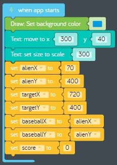
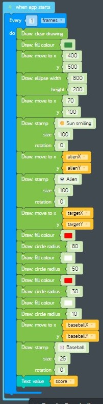

# Lesson 8 - games part 1

In this lesson we'll complete some challenges that show how to build a [PC game](https://en.wikipedia.org/wiki/PC_game). In the hands-on exercise we will start building our own PC game using the *baseball toss* theme from previous lessons. Over the next few lessons we'll add new features to our game to make it more fun.

## Review

In the previous lesson, we made some improvements to our *baseball toss* program by adding code to make the alien toss baseballs to different places on the canvas. To do this we used two new concepts:

* [Events](https://en.wikipedia.org/wiki/Event-driven_programming)
  * *Mouse* code blocks
    * *on click*  
      
    **figure 00-500-280** *on click* event code block from the *Mouse* tray
* [Linear interpolation](https://en.wikipedia.org/wiki/Linear_interpolation) more commonly known as *lerp*
  * *Math* code blocks
    * *lerp*  
      
    **figure 00-040-050** *lerp* code block from the *Math* tray

## Challenges

Before we start coding, we need to complete eight challenges. You don't have to complete them all right now, take your time. You will need to remember things from these challenges to complete the hands on exercise.

* [Challenges > Making a Pong Game > Making a Pong Game](https://code.kano.me/challenge/CLUB09/CLUB09_06_pong)
* [Challenges > Making a Pong Game > Setting Up](https://code.kano.me/challenge/CLUB09/CLUB09_01_pong)
* [Challenges > Making a Pong Game > Getting the Ball Rolling](https://code.kano.me/challenge/CLUB09/CLUB09_02_pong)
* [Challenges > Making a Pong Game > Hitting the Ball](https://code.kano.me/challenge/CLUB09/CLUB09_03_pong)
* [Challenges > Making a Pong Game > Coding Recap](https://code.kano.me/challenge/CLUB09/CLUB09_07_pong)
* [Challenges > Making a Pong Game > Making the AI](https://code.kano.me/challenge/CLUB09/CLUB09_04_pong)
* [Challenges > Making a Pong Game > Finishing the Game](https://code.kano.me/challenge/CLUB09/CLUB09_05_pong)
* [Challenges > Making a Pong Game > Coding Recap and Remixing](https://code.kano.me/challenge/CLUB09/CLUB09_08_pong)

## Hands on

Let's start building our own [PC game](https://en.wikipedia.org/wiki/PC_game) using the *baseball toss* theme. Instead of just having the alien toss baseballs over and over again to different places on the canvas, why not add a target that the player can try to hit with the baseball?

1. Start with an empty code space that has a *when app starts* code block. We will use it to put some of our setup code.
    1. Set the background color to blue.
    1. Add a new *Text* part. Move it to x = 300, y = 40. Make it bigger by setting the scale to 300.
    1. Create the following variables and initialize them using the information in this table:  
        Variable Name | Initial Value
        --- | ---
        alienX | 70
        alienY | 400
        targetX | 720
        targetY | 400
        baseballX | alienX
        baseballY | alienY
        score | 0
    1. Verify that your code looks like this:  
      
    **figure 08-010** Completed setup code
1. Next we will add code that redraws shapes on the canvas canvas each frame. We will draw five different shapes. Three of the shapes stay in the same place all the time (smiley sun, grassy hill, alien), and two of the shapes will move during game play (baseball and target). We will also update the score each time we draw a fresh frame.
    1. Drag a new *when app starts* event code block from the *App* tray onto the code space to help keep our code organized.
    1. Drag a new *every do* loop code block from *Control* tray and attach it inside the previous code block. Change "seconds" to "frames".
    1. Find the *clear drawing* code block from the *Draw* tray and attach it inside the previous code block.  
      
    **figure** *clear drawing* code block from the *Draw* tray
    1. Draw the following shapes inside the *every do* loop using the information in this table:
        Shape | Fill colour | x position | y position
        --- | --- | --- | ---
        Ellipse | Green | 400 | 500
        Stamp ("Sun smiling" size 100) | None | 70 | 100
        Stamp ("Alien" size 100) | None | alienX | alienY
        Circle (radius 80) | Red | targetX | targetY
        Circle (radius 50) | White | targetX | targetY
        Circle (radius 30) | Red | targetX | targetY
        Circle (radius 10) | White | targetX | targetY
        Stamp ("Baseball" size 25) | None | baseballX | baseballY
    1. Drag a new *value* code block from the *Text* part tray and connect it to the previous code block. Set the value to the variable *score*.
    1. Verify that your drawing code looks like this:  
      
    **figure 08-020** Completed drawing code
1. **Test your program:** Is the smiley sun in the upper-left? Is the alien in the lower-left? Is the target in the lower-right? Do the circles you drew look like a target? Is a score of 0 shown at the top?
1. **Save your program:** You need to save your program so you can start where you left off next lesson. Save your program by clicking on *Menu* > *Save*. This will save a copy of your code as a text file in the *Downloads* folder on your PC. See [baseball-toss-game-part-01.kcode](./baseball-toss-game-part-01.kcode) for a completed version of the program in this lesson.
