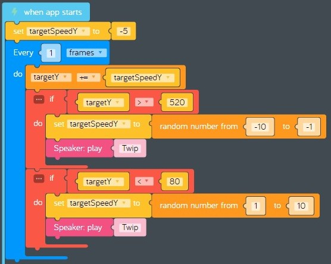

# Lesson 9 - games part 2

In this lesson we'll continue building our *baseball toss* game by adding code that makes the target move up and down at different speeds.

## Review

In the previous lesson, we started building our *baseball toss* game by adding code that redraws shapes on the canvas each frame. Some shapes are designed to stay in the same place (smiley sun, grassy hill, alien), and other shapes will move during game play (baseball and target).

## Hands on

Let's add code to make the target move. This code will change the variables that control where the target gets drawn each frame. When the target reaches the top or bottom of the canvas it needs to change direction. Each time the target changes direction the speed should change to make the game more challenging.

1. Drag a new *when app starts* event code block from the *App* tray onto the code space to help keep our code organized.
1. Drag a new *set variable* code block from the *Variables* tray and connect it inside the previous code block. Create a new variable named "targetSpeedY" and initialize it to -5. This will make the target start moving up five pixels at a time when our program starts.
1. Drag a new *every do* loop code block from *Control* tray and attach it to the previous code block. Change "seconds" to "frames".
1. Drag a new *increment variable* code block from the *Math* tray and attach it to the inside of the new *every do* loop. Set the variable to "targetY", leave the increment set to "+=" and set the value to "targetSpeedY". This will move the target by "targetSpeedY" pixels each frame.
1. Now we need to change the direction and play a sound whenever the target hits the bottom of the canvas.
    1. Drag a new *if do* code block from the *Logic* tray and attach it to the bottom of the previous code block. Set the condition to "targetY" > 520.
    1. When the target hits the bottom of the canvas it is moving in a positive direction on the y axis, so we need to change the direction by changing "targetSpeedY" to a random negative number between -10 and -1 pixels.
        1. Drag a new *set variable* code block from the *Variables* tray and attach it to the inside of the *if do* code block. Change the variable to "targetY".
        1. Find the *random number* code block in the *Math* tray.  
          
        **figure 00-040-040** *random number* code block from the *Math* tray.
        1. Drag a new *random number* code block from the *Math* tray and connect it to the right of the previous code block. Set the first number to -10 and the second number to -1.
        1. Find the *Speaker* part in *Add Parts* and add a new *Speaker*.  
          
        **figure 00-500-300** *Speaker* part in *Add Parts*
        1. Find the *play* code block in the *Speaker* tray.  
          
        **figure 00-500-310**
        1. Drag a new *play* code block from the *Speaker* tray and connect it to the bottom of the previous code block. Change "Claves" to "Twip*.
1. Now we need to change the direction and play a sound whenever the target hits the top of the canvas.
    1. Drag a new *if do* code block from the *Logic* tray and attach it to the bottom of the previous *if do* block. Set the condition to "targetY" < 80.
    1. When the target hits the top of the canvas it is moving in a negative direction on the y axis, so we need to change the direction by changing "targetSpeedY" to a random positive number between 1 and 10 pixels.
        1. Drag a new *set variable* code block from the *Variables* tray and attach it to the inside of the *if do* code block. Change the variable to "targetY".
        1. Drag a new *random number* code block from the *Math* tray and connect it to the right of the previous code block. Set the first number to 1 and the second number to 10.
        1. Drag a new *play* code block from the *Speaker* tray and connect it to the bottom of the previous code block. Change "Claves" to "Twip*.
1. Verify that your target moving code looks like this:  
  
**figure 09-010** Completed target moving code
1. **Test your program:** Does the target move up and down in the y axis? Do you hear the "Twip" sound when it hits the top or the bottom of the canvas? Does the target move at different speeds when it changes directions?  
1. **Save your program:** Save your program so you can start where you left off next lesson. See [baseball-toss-game-part-02.kcode](./baseball-toss-game-part-02.kcode) for a completed version of the program in this lesson.
