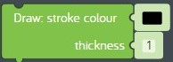
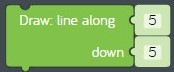
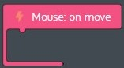

# Lesson 10 - games part 3

In this lesson we'll continue building our *baseball toss* game by adding code that draws a [reticle](https://en.wikipedia.org/wiki/Reticle) where the player wants to throw the baseball. A reticle is more commonly known as a "cross hair".

## Review

In the previous lesson we continued building our *baseball toss* game by adding code that makes the target move up and down at different speeds.

## Hands on

Let's add some code to draw a cross hair to mark where the player wants to throw the baseball.

1. Drag a new *when app starts* event code block from the *App* tray onto the code space to help keep our code organized.
1. Create the following variables and initialize them using the information in this table:  
    Variable Name | Initial Value
    --- | ---
    crosshairX | 400
    crosshairY | 300
    throwInProgress | 0
1. Verify that your code looks like this:  
  
**figure 10-010** Completed *when app starts* code
1. Find the *every 1 frames* code block used to draw shapes on the canvas.
1. Drag a new *move to* code block from the *Draw* tray and connect it to the bottom of the *text: value score* code block. Set the x value to "crosshairX" and the y value to "crosshairY".
1. Find the *stroke colour* code block in the *Draw* tray.  
  
**figure 00-080-060** *stroke colour* code block from the *Draw* tray
1. Draw a new *stroke colour* code block from the *Draw* tray and connect it to the previous block.
1. Find the *line along* code block in the *Draw* tray.  
  
**figure 00-080-100** *line along* code block from the *Draw* tray
1. Draw four line segments using the *line along* code block using the following settings:  
    along (x) | down (y)
    :-: | :-:
    0 | -20
    0 | 20
    -20 | 0
    20 | 0
1. Verify your code looks like this:  
  
**figure 10-020** Completed code to draw cross hair
1. Now let's get the cross hair to move when the mouse is over the canvas.
1. Add a new *Mouse* part from *Add Parts*.
1. Find the *on move* event code block in the *Moue* tray.  
  
**figure 00-500-295** *on move* event code block from the *Mouse* tray
1. Drag a new *on move* event code block from the *Mouse tray* onto the code space. The code inside this block will run whenever the mouse is moving over the canvas. We only want the cross hair to move when the ball is not being thrown.
    1. Drag a new *if do* code block from the *Logic* tray and connect it to the inside of the new *on move* code block.
    1. Find the *not* code block in the *Logic* tray.  
      
    **figure 00-030-050** *not* code block from the *Logic* tray
    1. Drag a new *not* code block from the *Logic* tray and attach it to the right of the new *if do* code block.
    1. Drag a new *set variable* code block from the *Variables* tray and attach it to the right of the new *not* code block. Change "item" to "throwInProgress". When "throwInProgress" is set to 0, this means "false", and when "throwInProgress" is set to 1 this means "true". So the code in the *if do* block will only run when there is no throw in progress. A variable used in true/false conditions is known as a "boolean" variable.
    1. To make the mouse move we need to change the x and y coordinates for where the cross hair gets drawn each frame to the current coordinates of the mouse.
        1. Find the *mouse x* and *mouse y* code blocks in the *Mouse* tray.  
          
        **figure 00-500-210** *mouse x* code block in the *Mouse* tray.  
          
        **figure 00-500-220** *mouse y* code block in the *Mouse* tray.
        1. Add two *set variable* code blocks to the inside of the *if do* code block and set them to the following values:  
            Variable | value
            --- | ---
            crosshairX | *mouse x*
            crosshairY | *mouse y*
1. Verify that the completed *Mouse: on move* code block looks like this:  
  
**figure 10-030** Completed *Mouse: on move* code block
1. Next let's write some code to mark where the alien will toss the baseball using the cross hair. We could mark the location using a mouse click, but we need to save that kind of event for a different use that we'll explain later. Instead we will use the location where the mouse button is released to mark the spot using the cross hair. Once we've marked the spot we will signal that the ball should be tossed by setting the "throwInProgress" variable to 1. Remember 1 is the same as "true" when you are using a boolean variable.
1. Find the *on release* event code block in the *Mouse* tray.  
  
**figure 00-500-290** *on release* code block from the *Mouse* tray
1. Drag a new *on release* event code block from the *Mouse tray* onto the code space. The code in this code block will run when the mouse button is released *after* it's been clicked.
    1. Add three *set variable* code blocks to the inside of the *Mouse: on release* code block and set them to the following values:  
        Variable | value
        --- | ---
        crosshairX | *mouse x*
        crosshairY | *mouse y*
        throwInProgress | 1
    1. Drag a new *play* code block from the *Speaker* tray and change the sound to "Swash".
1. Verify that the completed *Mouse: on release* code looks like this:  
  
**figure 10-040** Completed *Mouse: on release* code block.
1. **Test your program:** Move the mouse around on the canvas and click on the canvas. Do you hear the "Swash" sound? Did the cross hair stick to the spot where you released the mouse button? Use the *restart* button so you can test your program multiple times.  
1. **Save your program:** Save your program so you can start where you left off next lesson. See [baseball-toss-game-part-03.kcode](./baseball-toss-game-part-03.kcode) for a completed version of the program in this lesson.
