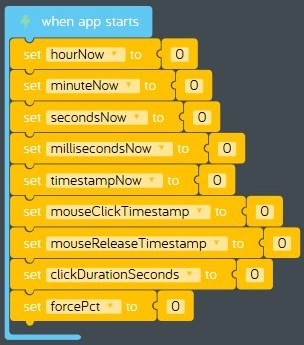

# Lesson 10 - games part 4

In this lesson we'll continue building our *baseball toss* game by adding code that allows the player to control how hard to throw the baseball.

## Review

In the previous lesson we added code that draws a cross hair where the player wants to throw the baseball.

## Hands on

Let's start adding some code that allows the player to throw the ball at different speeds. Before we start coding, let's make a plan. Sometimes it helps to work out the code in advance before you start coding. This process is called writing [pseudocode](https://en.wikipedia.org/wiki/Pseudocode). Let's use the amount of time the player holds down the mouse button to control how hard the alien throws the baseball. To do this we will need to calculate how long the mouse button was held down, then convert that into a force percentage.

1. **Timestamp calculation:** First, we need a way to record when the mouse button was clicked (*on click* event), and when the mouse button was released (*on release* event). Programming languages are like a tool box. Some programming languages like *Kano Code* provide a just a few simple tools. Others, like *JavaScript* have every tool you could imagine. Many programming languages have a tool for what we need called a *timestamp*, which is a number that represents a particular moment in time. It's perfect for recording when an event happened. Unfortunately *Kano Code* doesn't have a *timestamp* code block so we will have to make our own.  Using a digital clock we can measure the current time down to the milliseconds. When you check the time on a digital clock it looks like this: `HH:MM:SS.000`. Here's what each of the time parts mean:  
    Time Part | What it Means | Range | Notes
    :-: | :-: | :-: | ---
    HH | Hour | 0 - 23 | There are 24 hours in a day, hour 0 is just after midnight but before 1 in the morning)
    MM | Minute | 0 - 59 | There are 60 minutes in an hour.
    SS | Seconds | 0 - 59 | There are 60 seconds in a minute.
    000 | Milliseconds | 0 - 999 | There are 1,000,000 milliseconds in a second, but those are a lot of digits, so digital clocks convert milliseconds into thousandths of a second to make the time more readable.  
1. **Timestamp example:** We can get all of these time part values using a *Clock* part in *Kano Code*, but then we will need to combine them into a single number to make our *timestamp*. Since the digital clock converts milliseconds into thousandths of a second, we will need to convert everything to seconds then add them together to get our timestamp number.  Let's say the player clicks the mouse at exactly `12:02:10.730`, the *timestamp* number would be `43,330.730` which is the number of seconds past midnight when the user clicked the mouse. Here's how to calculate the *timestamp* number:  
    Time Part | Value | Convert to Seconds           |     | Value in Seconds
    :-:       | :-:   | :-:                          | --: | --:
    HH        | 12    | 12 x 60 minutes x 60 seconds |     | 43,200.000
    MM        | 02    | 2 x 60 seconds               | +   | 120.000
    SS        | 10    | 10                           | +   | 10.000
    000       | 730   | 730 ÷ 1,000                  | +   | 0.730
    Timestamp |       |                              | =   | 43,330.730  
1. **Calculating duration using timestamps:** Now that we have a way of recording a specific moment in time using a timestamp, we have a way to measure the length of time between two events. Here's the math for calculating how many seconds the player held down the mouse button:
`durationSeconds = mouseReleaseTimestamp - mouseClickTimestamp`
1. **Timestamp midnight bug:** This code will work great except for one thing, can you guess? What happens at midnight when the time rolls over from `23:59:59.999` to `00:00:00.000`into the next day? It is very unlikely that this will happen, the player would have to click the mouse just before midnight and release the mouse just after midnight, and most players should be in bed by then. If we didn't handle this in our code it would be a [software bug](https://en.wikipedia.org/wiki/Software_bug). Since this will probably never happen, we will avoid this bug by restarting our program if this happens so our game doesn't do anything weird. Don't tell anybody we cheated!  
`if (mouseReleaseTimestamp < mouseClickTimestamp) then restart program`  
1. **Calculating the force percentage:** Finally, we need to convert the length of time the player holds down the mouse button into a force percentage. Let's set the maximum time the player needs to hold down the mouse to 3 seconds, which would be a force percentage of 100%. If the player doesn't hold down the mouse button, we don't want the ball to move too slow, so let's set the minimum force percentage to 10%.  
`forcePct = clickDurationSeconds ÷ 3`  
`if (forcePct < 0.1) then (forcePct = 0.1)`  
`if (forcePct > 1) then (forcePct = 1)`
1. Okay now it's time to turn our pseudocode into real code. Drag a new *when app starts* event code block from the *App* tray into the code space. We keep adding new ones so we can keep the code for each section separate. This makes it easier to [debug](https://en.wikipedia.org/wiki/Debugging) our program.
1. Create and initialize 8 new variables inside the previous code block:  
    Variable | Initial Value
    --- | ---
    hourNow | 0
    minuteNow | 0
    secondsNow | 0
    millisecondsNow | 0
    timestampNow | 0
    mouseClickTimestamp | 0
    mouseReleaseTimestamp | 0
    clickDurationSeconds | 0
    forcePct | 0
1. Verify your code looks like this:  
      
    **figure 11-010** Completed *when app starts* code block
1. Next let's add the code to calculate "mouseClickTimestamp".
    1. Drag a new *on click* event code block from the *Mouse* tray and place it near the other mouse events on your code space.
    1. Attach a new *set variable* code block inside the new *mouse: on click* event code block and use it to reset "timestampNow" to 0.
    1. Attach a new *set variable* code block to the previous code block and change the variable from "item" to "hourNow".
    1. Attach a new *arithmetic* code bock from the *Math* tray and attach it to the right of the previous code block. Change the arithmetic operator from "add" to "multiply".
    1. Locate the *Clock* part in *Add Parts*.
        
        **figure 00-500-400** *Clock* part from *Add Parts*
    1. Add a new *Clock* part from *Add Parts*.
    1. Locate the *Clock current: Year* code block in the *Clock* tray.  
          
        **figure 00-500-410** *Clock current: Year* code block in the *Clock* tray.
    1. Drag a new *Clock current: Year* code part from the *Clock* tray and connect it into the first slot of the arithmetic code block. Change "Year" to "Hour".
    1. Drag a new *arithmetic* code block from the *Math* tray and connect it to the second slot of the previous code block. Change the first number to 60, change the arithmetic operator from "add" to "to the power of". Change the second number to 2.
    1. This converts the current hour into seconds, and uses [exponentiation](https://en.wikipedia.org/wiki/Exponentiation) to simplify the formula. Instead of having to code `currentHour x 60 x 60` we just used the formula `currentHour x 60^2`. Verify your code looks like this:  
          
        **figure 11-020** Completed hours to seconds calculation
    1. Attach a new *set variable* code block to the previous code block and change the variable from "item" to "minuteNow".
    1. Drag a new *arithmetic* code bock from the *Math* tray and connect it to the right of the previous code block. Change the arithmetic operator from "add" to "multiply".
    1. Drag a new *Clock current: Year* code block from the *Clock* tray and connect it to the first slot of the previous code block. Change "Year" to "Minute".
    1. Change the number in the second slot of the *arithmetic* code block from 0 to 60. Verify your code looks like this:  
          
        **figure 11-030** Completed minutes to seconds calculation
    1. Attach a new *set variable* code block to the previous code block and change the variable from "item" to "secondsNow".
    1. Drag a new *Clock current: Year* code block from the *Clock* tray and connect it to the right of the previous code block. Change "Year" to "Seconds".
    1. Attach a new *set variable* code block to the previous code block and change the variable from "item" to "millisecondsNow".
    1. Drag a new *arithmetic* code bock from the *Math* tray and connect it to the right of the previous code block. Change the arithmetic operator from "add" to "divide".
    1. Drag a new *Clock current: Year* code block from the *Clock* tray and connect it to the first slot of the previous code block. Change "Year" to "Milliseconds".
    1. Change the number in the second slot of the *arithmetic* code block from 0 to 1000. Verify your code looks like this:  
          
        **figure 11-040** Completed milliseconds to seconds calculation
    1. Now it's time to add everything up and store the total in "timeStampNow". Use the *increment variable* code block from the *Math* tray to add "hourNow", "minuteHow", "secondsNow" and "millisecondsNow" to "timestampNow". Your completed code should look like this:  
          
        **figure 11-050** Completed code to add up timestampNow
    1. Attach a new *set variable* code block to the previous code block and change the variable from "item" to "mouseClickTimestamp". Set the value to "timestampNow". Your completed code should look like this:  
        
        **figure 11-060** Completed code to calculate "mouseClickTimestamp"
    1. But wait, we are only half done, we have to do all of the same calculations for "mouseReleaseTimestamp" right? Wouldn't it be great if we could just use some code we already have written? This is called [code reuse](https://en.wikipedia.org/wiki/Code_reuse). Because of the way we have written the *timestamp* code, we can re-use it over and over again whenever we create a new *timestamp*.
        1. Using the *Kano Code* "Duplicate" feature, make a copy of all the code blocks you wrote in the previous section and attach them to the last code block in the *Mouse: on release* code block.
        1. Change the last *set variable* code block you copied from "mouseClickTimestamp" to "mouseReleaseTimestamp". Your completed code should look like this:  
          
        **figure 11-070** Completed *Mouse: on release* code block
    1. Now let's add a calculation that will record how many seconds the player held the mouse button down. Let's also take care of the *timestamp midnight bug* we talked about earlier.
        1. Drag a new *if do else* code block from the *Logic* tray and connect it to the last code bock in the *Mouse: on release* event code block.
        1. Drag a new *compare* code block from the *Logic* tray and connect it to the right if the previous *if* code block. Set the first slot of the condition to "mouseReleaseTimestamp", set the condition to "greater than", and set the second slot of the condition to "mouseClickTimestamp".
        1. Drag a new *set variable* code block from the *Variables* tray and connect inside the *if* portion of the *if do else* code block. Set the variable to "clickDurationSeconds".
        1. Drag a new *arithmetic* code block from the *Math* tray and connect it to the right of the previous code block. Set the first slot to "mouseReleaseTimestamp", set the operator to "subtract", and set the second slot to "mouseClickTimestamp".
        1. If the *else* portion of this statement runs, that means that "mouseClickTimestamp" is greater than "mouseReleaseTimestamp", which means that the player clicked the mouse button just before midnight, and released it just after midnight. We decided to handle this situation by restarting our program. 1. Find the *restart code* code block in the *Control* tray.  
          
        **figure 00-020-050** *restart code* code block in the *Control* tray
        1. Drag a new *restart code* code block from the *Control* tray and connect it inside the *else* portion of the *if do else* code block.
        1. Verify your completed code looks like this:  
          
        **figure 11-080** Completed "clickDurationSeconds" calculation with bug handling code
    1. Now that we have calculated "clickDurationSeconds" we can use it to calculate our "forcePct".
        1. Drag a new *set variable* code block from the *Variables* tray and attach it to the previous code block. Change the variable to "forcePct".
        1. Drag a new *arithmetic* code block from the *Math* tray and attach it to the right of the previous code block. Set the calculation to "clickDurationSeconds ÷ 3".
        1. Drag a new *set variable* code block from the *Variables* tray and attach it to the previous code block. Change the variable to "forcePct".
        1. Find the *constrain* code block in the *Math* tray.  
          
        **figure 00-040-120** *constrain* code block in the *Math* tray
        1. Drag a new *constrain* code block from the *Math* tray and connect it to the right of the previous code block. Set the value in the first slot to "forcePct", set the "low" value to 0.1 and set the "high" value to 1. This will make sure the "forcePct" is never less than 10% and never greater than 100%.
1. Now let's display the length of time in seconds that the player held down the mouse button.
    1. Add a new *Text* part from *Add Parts*. Since you already have a text part this one will be called "Text 2".
    1. Find the *when app starts* event code block you added in this lesson.
    1. Drag a new *move to* code block from the *Text 2* tray and attach it to the last code bock in the *when app starts* code block. Set the x value to 400 and the y value to 550. Your completed code should look like this:  
      
    **figure 11-090** Completed *when app starts* event code block
    1. Find the *every 1 frames* code block used to redraw shapes on the canvas.
    1. Drag a new *value* code block from the *Text 2* tray and attach it to the last code block in the *every 1 frames* loop. Set the value to "clickDurationSeconds". Your completed code should look like this:  
      
    **figure 11-100** Completed *every 1 frames* loop code block
1. **Test your program:** Restart your program, then click the mouse button on the canvas and hold it down for 3 seconds before you release it. The number on the bottom of the screen shows the force percentage. Try it a few times by restarting your program and holding the mouse button down for different lengths of time. Is it ever less than 0.1 (10%)? Is it ever greater than 1 (100%)?
1. **Save your program:** Now would be a good time to take a break and come back later to continue working on the hands on exercise. Save your program by clicking on *Menu* > *Save*. See [baseball-toss-game-part-04.kcode](./baseball-toss-game-part-04.kcode) if you can't find your program later.
