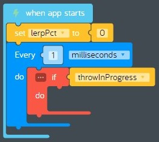
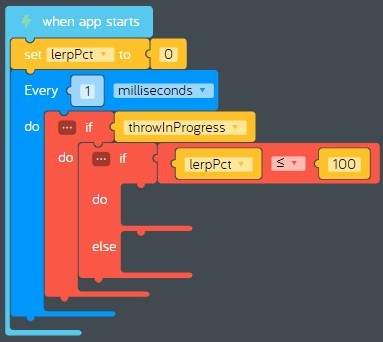
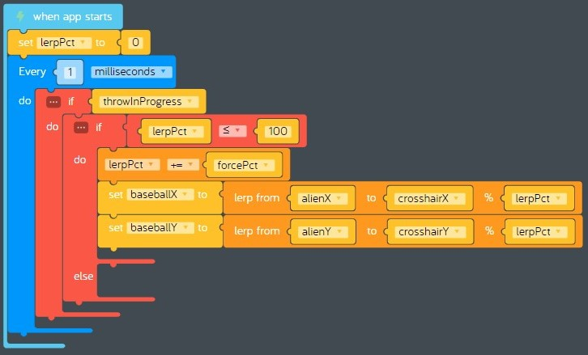
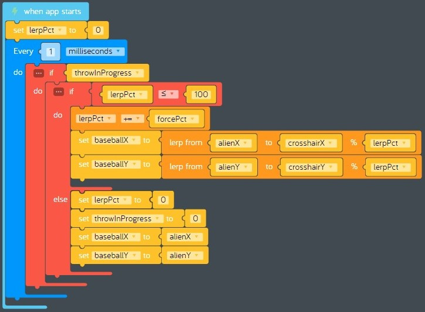

# Lesson 12 - games part 5

In this lesson we'll continue building our *baseball toss* game by adding code that draws the baseball on the canvas when it is thrown at the target.

## Review

In the previous lesson we added code that allows the player to control how hard to throw the baseball.

## Hands on

Before we start coding, let's make a plan. First, let's review the variables we can use to draw the baseball when it is thrown.

Variable | Usage
--- | ---
throwInProgress | A boolean that indicates whether a throw is in progress. 0 (false) means no throw is in progress. 1 (true) means a throw is in progress.
alienX, alienY | The x and y coordinates for the alien, which is where baseball throws start.
baseballX, baseballY | The x and y coordinates for the current location of the baseball.
crosshairX, crosshairY | The x and y coordinates for the current location of the reticle, which is where baseball throws end.
forcePct | A number from 0.1 (10%) to 1 (100%) which controls how hard the baseball is thrown.

Remember we have a code block that draws all the shapes we want on our canvas each frame. This is known as [rendering](https://en.wikipedia.org/wiki/Rendering_(computer_graphics)). We need to add code that checks to see if a throw is in progress, and if it is we need to change where baseball will be drawn when the next frame gets rendered.  Do you remember the *lerp* code block from the previous lesson? When given two numbers, *lerp* returns a number that is between them using a percentage. We will use it again here to determine new x and y coordinates for the baseball when a throw is in progress.  

We also need to control how fast the baseball moves using the *forcePct* variable we added in the last lesson. This is the hardest part of this feature to figure out. When programming a game, the video quality depends upon the [frame rate](https://en.wikipedia.org/wiki/Frame_rate), which is the rate which consecutive frames are rendered. A high frame rate results in smooth motion, like a high definition movie. A low frame rate results in jerky motion, like an old silent movie. Depending on how fast your computer is, Kano Code's frame rate is roughly 30 frames per second. That means it would take about three seconds to draw 100 frames if we incremented the *lerp* percentage once per frame from 0 to 100. That's too slow. However, if we increment the *lerp* percentage by 1 each millisecond, it takes 100 milliseconds to *lerp* from 0 to 100. That's pretty fast. Let's make the following assumptions:

* The fastest throw will happen when *forcePct* = 1, and will take 100 milliseconds to complete from start to finish.
* The slowest throw will happen when *forcePct* = 0.1, and will take 1000 milliseconds to complete from start to finish.

Finally, we need to move the baseball back to it's original position when the throw is complete. Okay let's get started!

1. First we need to declare a new variable to track our *lerp* percentage, then create a loop that we can use to change the position of the baseball if a throw is in progress.
    1. Drag a new *when app starts* code block from the *App* tray onto the canvas.
    1. Drag a new *set variable* code block from the variable tray and attach it to the inside of the previous code block. Use it to create a new variable named *lerpPct* and set it to 0.
    1. Drag a new *every 1 seconds* code block from the *Control* tray and attach it to the previous code block. Change *seconds* to *milliseconds*.
    1. Drag a new *if do* code block from the *Logic* tray and attach it to the inside of the previous code block.
    1. Drag a new *get variable* code block from the *Variables* tray and connect it to the right *if* portion of the previous code block. Change *item* to *throwInProgress*.
    1. Verify your code looks like this:  
      
1. Next, we need to check the current value of *lerpPct* to see if it is less than or equal to 100 and the throw is in progress, or greater than 100 and the throw is over.
    1. Drag a new *if do else* code block from the *Logic* tray and attach it to the inside of the previous code block. This is called a [nested](https://en.wikipedia.org/wiki/Nested_function) if.
    1. Drag a new *compare* code block from the *Logic* tray and attach it to the right of the previous code block. Set the first value to "lerpPct", set the comparison operator to "less than or equal", and set the second value to 100.
    1. Verify your code looks like this:  
      
1. Next, we will add code that will increment *lerpPct* and change the x and y coordinates of the baseball using *lerp* functions.
    1. Drag a new *increment variable* code block from the *Math* tray and connect it inside the *if* portion of the previous *if do else* code block. Change *item* to *lerpPct*, leave the operator set to "+=", and set the value to "forcePct".
    1. Drag a new *set variable* code block from the *Variables* tray and connect it to the bottom of the previous code block. Change "item" to "baseballX".
    1. Drag a new *lerp* code block from the *Math* tray and connect it to the right of the previous code block. Set the "from" value to "alienX", set the "to" value to "crosshairX", and set the "%" value to "lerpPct".
    1. Drag a new *set variable* code block from the *Variables* tray and connect it to the bottom of the previous code block. Change "item" to "baseballY".
    1. Drag a new *lerp* code block from the *Math* tray and connect it to the right of the previous code block. Set the "from" value to "alienY", set the "to" value to "crosshairY", and set the "%" value to "lerpPct".
    1. Verify your code looks like this:  
      
1. Finally, we will reset everything when the baseball throw is complete.
    1. Drag a new *set variable* code block from the *Variables* tray and connect it to the inside of the *else* portion of the *if do else* code block. Change "item" to "lerpPct" and set the value to 0.
    1. Drag a new *set variable* code block from the *Variables* tray and connect it to the previous code block. Change "item" to "throwInProgress" and set the value to 0.
    1. Drag a new *set variable* code block from the *Variables* tray and connect it to the previous code block. Change "item" to "baseballX" and set the value to "alienX".
    1. Drag a new *set variable* code block from the *Variables* tray and connect it to the previous code block. Change "item" to "baseballY" and set the value to "alienY".
    1. Verify your code looks like this:  
      
1. **Test your program:** Test throwing the baseball at different speeds.
1. **Save your program:** Save your program by clicking on *Menu* > *Save*. See [baseball-toss-game-part-05.kcode](./baseball-toss-game-part-05.kcode) for a completed version.
