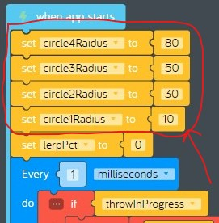
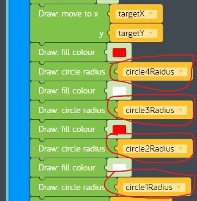
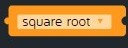
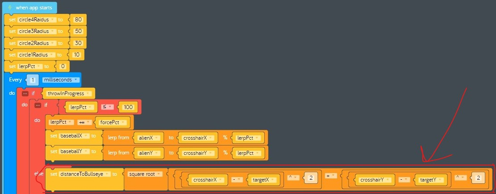
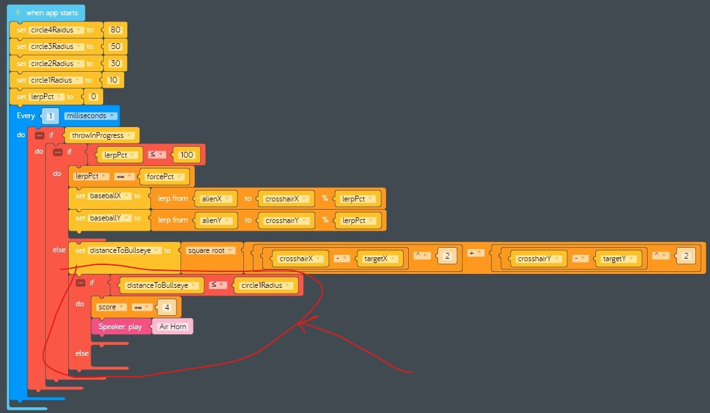
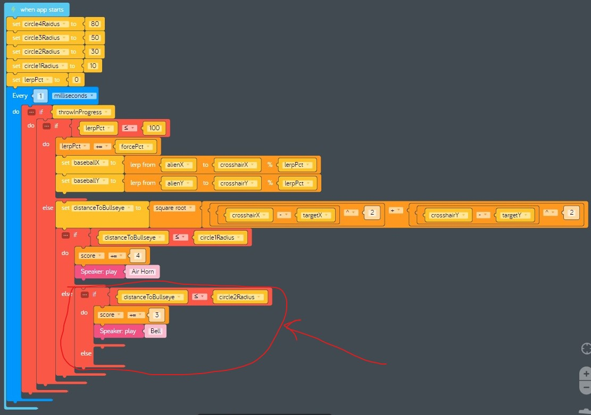
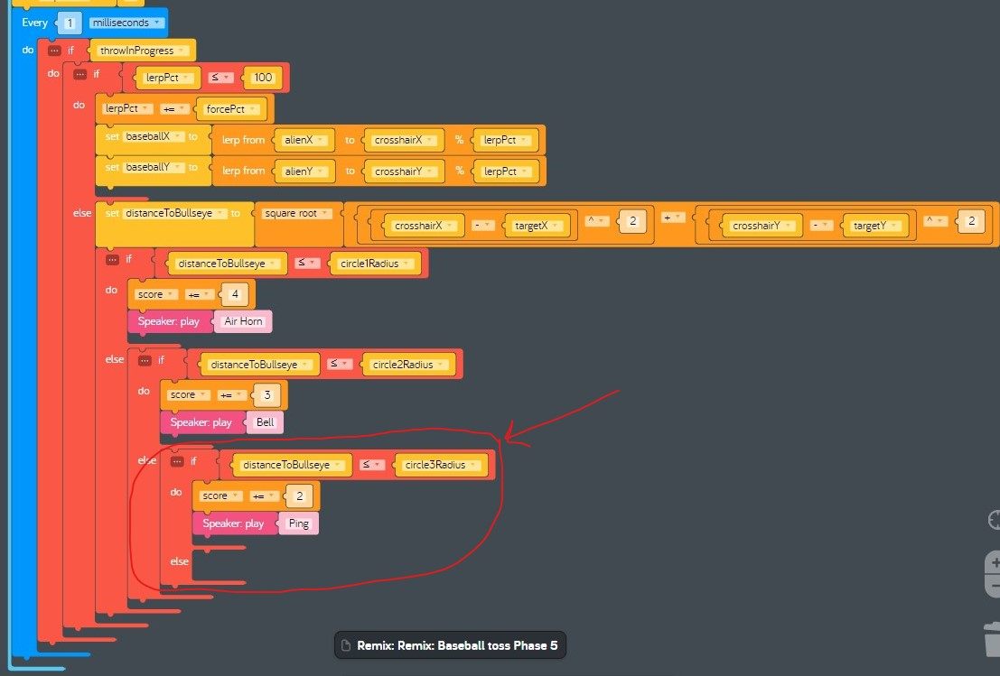
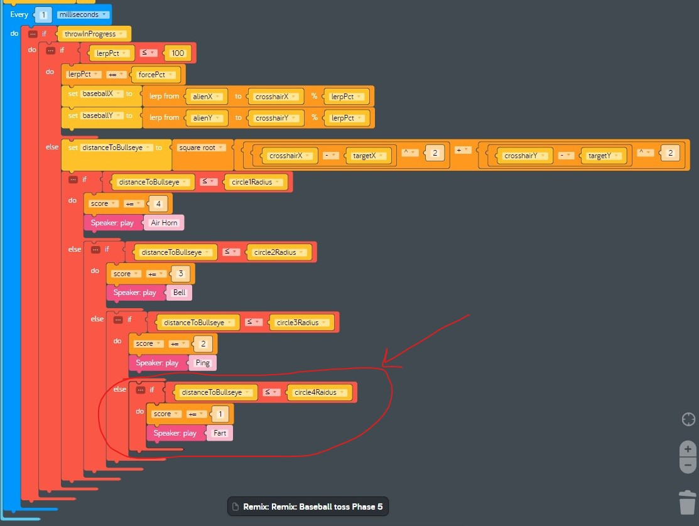
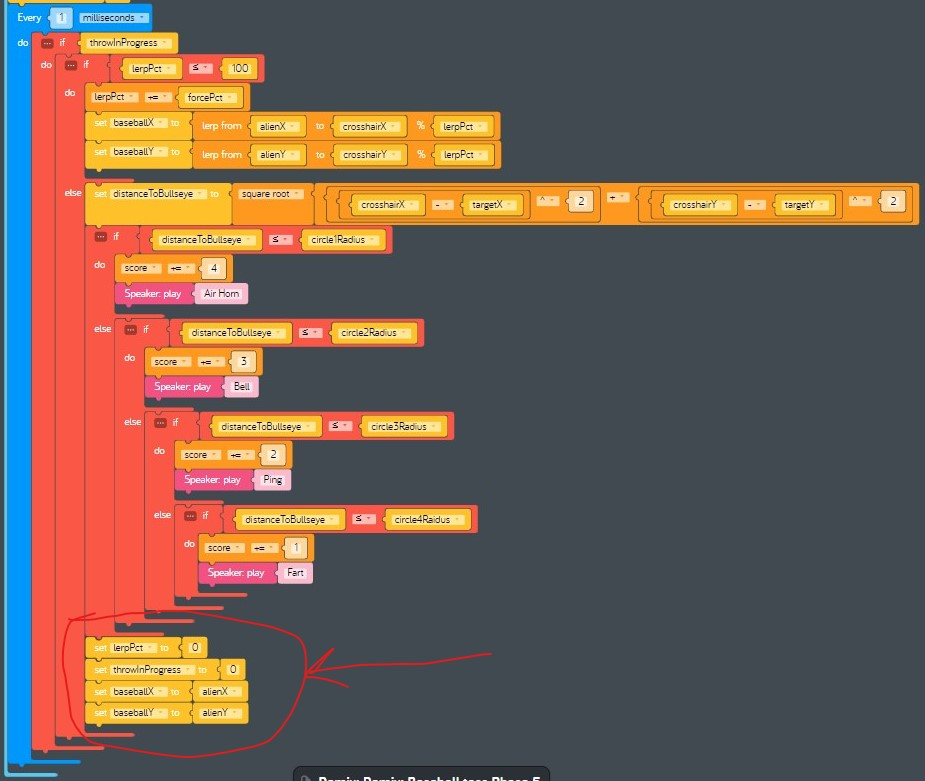

# Lesson 13 - games part 6

In this lesson we'll continue building our *baseball toss* game by adding code that scores points when the baseball hits the target.

## Review

In the previous lesson we added code that draws the baseball on the canvas when it is thrown at the target.

## Hands on

Before we start coding, let's make a plan. First, let's review the variables we can use to determine if the baseball hit the target.

Variable | Usage
--- | ---
lerpPct | A percentage from 0 to 100 we use to set the current location of the baseball using *lerp*. When *lerpPct* is 100, that is the end of the throw.
targetX, targetY | The x and y coordinates of the current location of the center of the target, also known as the *bullseye*.
crosshairX, crosshairY | The x and y coordinates of the current location of the reticle.

This would be enough if we only wanted to the player to score points when they hit a bullseye, but that is really hard to do and the game wouldn't be very much fun. What we need is a way to score points depending upon which part of the target the baseball hits. More points should be awarded when the player hits a smaller part of the target. Remember, we use four circles to draw the target, each with a different radius. Here are the circles listed from largest (easist to hit) to smallest (hardest to hit), and the points the player will score if they hit that circle.

Circle | Radius | Points
--- | --- | ---
Circle4 | 80 pixels | 1 (largest circle, easiest to hit, only scores 1 point)
Circle3 | 50 pixels | 2
Circle2 | 30 pixels | 3
Circle1 | 10 pixels | 4 (smallest circle, hardest to hit, scores 4 points!)

Okay now that we have a point system, all we have to do is work out the code for determining which circle the player hit. Remember, the target is moving. Let's simplify things by only checking for a hit at the end of the throw when *lerpPct* is 100. The center of each circle can be determined by the values *targetX* and *targetY* at the end of the throw, and the final location of the baseball can be determined by the values *crosshairX* and *crosshairY*.

We need a formula for determining whether the location of the baseball at the end of the throw is inside one of the target circles. There's a perfect geometric formula for this called the [pythagorean theorem](https://en.wikipedia.org/wiki/Pythagorean_theorem), which is useful for calculating the length of the [hypotenuse](https://en.wikipedia.org/wiki/Hypotenuse) of a right triangle. In our case, the hypotenuse is the distance between the final location of the baseball and the bullseye. If that distance is less than or equal to the radius of one of our circles, the player scored a hit! Since there are four circles, and the smaller circles score more points, we will check for the hardest circle first, and the easiest circle last. Once we've determined a circle was hit, we will stop checking.

Okay, now that we have our plan, let's start coding! Go ahead and load the saved version of your code from the previous lesson.

1. First we need to create some variables for the radius we used to draw each of the four circles that make up the target. We hard coded these values in a previous lesson instead of using variables. A hard coded value in a program is known as a [constant](https://en.wikipedia.org/wiki/Constant_(computer_programming)). We need to convert those constants into variables so we can reference them in other parts of our program.
    1. Locate the *when app starts* code block that has *set lerPct to* as the first code block. This is the code block you added in the previous lesson that calculates the next position where the baseball is drawn.
    1. Insert four new *set variable to* code blocks right after *when app starts* using the information in this table:  

    Variable | Value
    --- | ---
    circle4Radius | 80
    circle3Radius | 50
    circle2Radius | 30
    circle1Radius | 10

    1. Verify your completed code looks like this:  
      
1. Next we need to change the code we used to draw the four target circles from using a constant for each radius to our newly created variables.
    1. Locate the *when app starts* code block that starts with *every 1 frames*.
    1. Change the constants used as the radius when drawing each of the four circles to the corresponding variable according to this table:  

    Radius | Variable
    --- | ---
    80 | circle4Radius
    50 | circle3Radius
    30 | circle2Radius
    10 | circle1Radius

    1. Verify your completed code looks like this:  
      
1. Now we can add our scoring code using the pythagorean theorem. This one is tricky so take your time. This is the formula we will be constructing using code blocks:  
    `distanceToBullseye = squareroot ( ( (crosshairX - targetX) ^ 2 ) + ( (crosshairY - targetY) ^ 2 ) )`
    1. Locate the *when app starts* code block that starts with *set circleRadius to 80*.
    1. Locate the *else* portion of the *if lerpPct <= 100* code block. This is the code that runs when *lerpPct* = 100 at the end of the throw, which is when we want to see if the player scored any points.
    1. Drag the four code blocks starting with *set lerpPct to 0* and ending with *set baseballY to alienY* off to the side for later use.
    1. Drag a new *set variable* code block from the *Variables* tray and connect it to the inside of the *else* code block. Create a new variable called "distanceToBullseye".
    1. Locate the *square root* code block in the *Math* tray.  
      
    1. Drag a new *square root* code block from the *Math* tray and attach it to the right of the previous code block.
    1. Drag a new *arithmetric* code block from the *Math* tray and attach it to the right of the previous code block.
    1. Drag two new *arithmetic* code blocks and connect them to each slot of the previous code block. Change the operator from "+ add" to "^ to the power of" for both.
    1. Drag two new *arithmetic* code blocks and connect them to the first slot of each of the inner-most *Arithmetic* code blocks. Change the operator from "+ add" to "- substract" for both.
    1. From left to right, change each constant 0 to the following values for the new *Arithmetic* code blocks:  

    Position | Value
    --- | ---
    1 | crosshairX
    2 | targetX
    3 | 2
    4 | crosshairY
    5 | targetY
    6 | 2

    1. Verify your completed code looks like this:  
      
1. Finally we will add code to check whether the player scored any points. We will use nested *if* statements to stop checking once a circle is hit.
    1. Drag a new *if do else* code block from the *Logic* tray and attach it to the bottom of the previous code block.
    1. Drag a new *compare* code block from the *Logic* tray and attach it to the right of the previous *if* code block. Change the operator from "= equal" to "≤ less than or equal". Change the value in the first slot from "0" to "distanceToBullseye", and change the value in the second slot from "0" to "circle1Radius". This is the code that will run if the player hit the smallest circle that is hardest to hit.
    1. Drag a new *increment variable* code block from the *Math* tray and connect it to the bottom of the previous *if* code block. Change "item" to "score" and change "1" to "4".
    1. Drag a new *Play* code block from the *Speaker* tray and attach it to the bottom of the previous code block. Change *Claves* to *Air Horn*.
    1. Verify your completed code looks like this:  
      
    1. One circle down, three to go! Drag a new *if do else* code block from the *Logic* tray and connect it to the inside of the *else* portion of the previous code block.
    1. Drag a new *compare* code block from the *Logic* tray and attach it to the right of the previous *if* code block. Change the operator from "= equal" to "≤ less than or equal". Change the value in the first slot from "0" to "distanceToBullseye", and change the value in the second slot from "0" to "circle2Radius".
    1. Drag a new *increment variable* code block from the *Math* tray and connect it to the bottom of the previous *if* code block. Change "item" to "score" and change "1" to "3".
    1. Drag a new *Play* code block from the *Speaker* tray and attach it to the bottom of the previous code block. Change *Claves* to *Bell*.
    1. Verify your completed code looks like this:  
      
    1. Two circles down, two to go! Drag a new *if do else* code block from the *Logic* tray and connect it to the inside of the *else* portion of the previous code block.
    1. Drag a new *compare* code block from the *Logic* tray and attach it to the right of the previous *if* code block. Change the operator from "= equal" to "≤ less than or equal". Change the value in the first slot from "0" to "distanceToBullseye", and change the value in the second slot from "0" to "circle3Radius".
    1. Drag a new *increment variable* code block from the *Math* tray and connect it to the bottom of the previous *if* code block. Change "item" to "score" and change "1" to "2".
    1. Drag a new *Play* code block from the *Speaker* tray and attach it to the bottom of the previous code block. Change *Claves* to *Ping*.
    1. Verify your completed code looks like this:  
      
    1. Three circles down, one to go! Drag a new *if do* code block from the *Logic* tray and connect it to the inside of the *else* portion of the previous code block.
    1. Drag a new *compare* code block from the *Logic* tray and attach it to the right of the previous *if* code block. Change the operator from "= equal" to "≤ less than or equal". Change the value in the first slot from "0" to "distanceToBullseye", and change the value in the second slot from "0" to "circle4Radius".
    1. Drag a new *increment variable* code block from the *Math* tray and connect it to the bottom of the previous *if* code block. Change "item" to "score".
    1. Drag a new *Play* code block from the *Speaker* tray and attach it to the bottom of the previous code block. Change *Claves* to *Fart*.
    1. Verify your completed code looks like this:  
      
    1. Locate the four code blocks starting with *set lerpPct to 0* and ending with *set baseballY to alienY* you set aside earlier. Connect them to the bottom of the *if distanceToBullseye ≤ circle1Radius do else* code block.
    1. Verify your completed code looks like this:  
      
1. **Test your program:** Restart your program, then play the game. Do you score any points when you don't hit the target? Does the score go up when you hit the target? Are a higher number of points awarded when you hit smaller parts of the target?
1. **Save your program:** Save your program by clicking on *Menu* > *Save*. See [baseball-toss-game-part-06.kcode](./baseball-toss-game-part-06.kcode) for a completed version.
