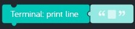

# Lesson 14 - games part 7

In this lesson we'll add the finishing touches to our *baseball toss* game including player instructions, time limits, and high score tracking.

## Review

In the previous lesson we added code that scores points when the baseball hits the target.

## Hands on

Let's add some finishing touches to our game to make it better:

* Players who have never played the game before are going to need some help.
* Let's add a time limit of 60 seconds per game.
* Let's add code that tracks the high score.

1. Drag a new *When app starts* code block from the *App* tray onto the code space.
1. Add three new variables and connect them to the inside of the previous code block:  
    Variable | Type | Value  
    --- | --- | ---  
    gameInProgress | boolean | 0  
    secondsRemaining | number | 0  
    highScore | number | 0
1. Verify your code looks like this:  
  
1. Let's add a [terminal](https://en.wikipedia.org/wiki/Terminal_emulator) to our game that we can use to help players learn how to play and print out scores.
    1. Add a new *Terminal* part from *Add Parts*  
      
    1. Locate the *Visible* code block in the *Terminal* tray:  
    
    1. Drag a new *Visible* code block from the *Terminal* tray and attach it to the previous code block. Leave the value set to *show*.
    1. Locate the *Print line* code block in the *Terminal* tray:  
      
    1. Use the *Print line* code blocks to display the following messages in the terminal. Substitute your own Kano username for "MyKanoUsername".  
        Line | Message
        --- | ---
        1 | >>> Baseball Toss <<< by MyKanoUsername
        2 | ---------------------------------------------
        3 | Here's how to play:
        4 | \* Aim at the target using the mouse
        5 | \* Hold down the mouse button to throw harder
        6 | \* Score more points by hitting the target near the center
        7 | \* Score as many points as you can in 60 seconds
        8 | \* Click on on the canvas to start the game
    1. Verify your code looks like this:  
      
1. Next, let's set the time limit to 60 seconds per game.
    1. Drag a new *Every 1 seconds* code block from the *Control* tray and attach it to the previous code block.
    1. Drag a new *if do* code block from the *Logic* code tray and attach it inside the previous code block.
    1. Drag a new *get variable* code block from the *Variables* tray and connect it to the right of the previous *if* block. Set the value to "gameInProgress".
    1. Verify your code looks like this:  
      
    1. Drag a new *if do else* code block from the *Logic* tray and connect it to the inside of the previous code block. Do you remember the term used when one *if* statement is inside another *if* statement? It's called a "nested if".
    1. Drag a new *compare* code block from the *Logic* tray and connect it to the right of the previous *if* statement. Set the operator to "> greater than".
    1. Drag a new *get variable* code block from the *Variables* tray and connect it inside the first slot of the previous code block. Change "item" to "secondsRemaining".
    1. Drag a new *get number* code block from the *Variables* tray and connect it inside the second slot of the previous code block. Leave the number set to 0.
    1. Drag a new *increment variable* code block from the *Math* tray and connect it to the inside of the previous *if* statement. Change "item" to "secondsRemaining", set the operator to "-=" and leave the number set to "1".
    1. Add a new *Text-To-Speech* part from *Add Parts*:  
      
    1. Locate the *Say* code block from the *Text-To-Speech* tray:  
      
    1. Drag a new *Say* code block from the *Text-To-Speech* tray and connect it to the previous code block. Change the "speed" value to 200 and set the language to "US English". This will make your code talk!
    1. Drag a new *Get variable* code block from the *Variables* tray and connect it to the *say* connector in the previous code block. Change "item" to "secondsRemaining".
    1. Verify your code looks like this:  
      
1. Next, let's print out the score when the game is over.
    1. Drag a new *Play* code block from the *Speaker* tray and connect it to the inside of the *else* portion of the previous *if do else* code block. Change "Claves" to "Challenge Complete".
    1. Drag a new *Visible* code block from the *Terminal* tray and connect it to the previous code block. Leave the value set to "show".
    1. Drag a new *Print line* code block from the *Terminal* tray and set it to "---------------------------------------------".
    1. Locate the *Print* code block in the *Terminal* tray:  
      
    1. Drag a new *Print* code block from the *Terminal* tray and connect it to the previous code block. Change the value to "Score: ".
    1. Drag a new *Print line* code block from the *Terminal* tray and connect it to the previous code block.
    1. Drag a new *Get variable* code block from the *Variables* tray and connect it to the right of the previous code block. Change "item" to "score".
    1. Drag a new *if do* code block from the *Logic* tray and connect it to the previous code block.
    1. Drag a new *Comparison* code block from the *Logic* tray and connect it to the right of the previous *if* statement. Change the operator to "> greater than".
    1. Drag a new *Get variable* code block from the *Variables* tray and connect it to the first slot of the previous code block. Change the value from "item" to "score".
    1. Drag a new *Get variable* code block from the *Variables* tray and connect it to the second slot of the previous code block. Change the value from "item" to "highScore".
    1. Drag a new *Print line* code block from the *Terminal* tray and connect it to the inside of the previous *if* statement. Change the value to "Way to go, that's a new high score!".
    1. Drag a new *Set variable* code block from the *Variables* tray and connect it to the previous code block. Change "item" to "highScore".
    1. Drag a new *Get variable* code block from the *Variables* tray and attach it to the right of the previous code block. Change "item" to "score".
    1. Drag a new *Print line* code block from the *Terminal* tray and connect it to the bottom of the previous *if do* code block. Set the value to "---------------------------------------------".
    1. Drag three new *Set variable* code blocks from the *Variables* tray and connect them to the previous code block. Set the values as follows:  
        Variable | Value
        --- | ---
        gameInProgress | 0
        secondsRemaining | 60
        score | 0
    1. Verify your code looks like this:  
      
1. Next, let's modify the code blocks that run when the mouse button is clicked.
    1. Locate the *Mouse: on click* code block on the canvas, it should look like this:  
    
    1. Drag all the code blocks that are inside *Mouse: on click* and set them aside for use later.
    1. Drag a new *if do* code block from the *Logic* tray and connect it to the inside of *Mouse: on click*.
    1. Drag a new *not* code block from the *Logic* tray and connect it to the right of the previous *if* statement.
    1. Drag a new *Get variable* code block from the *Variables* tray and connect it to the right of the previous *not* statement. Change "item" to "gameInProgress".
    1. Drag two new *Set variable* code blocks from the *Variables* tray and connect them to the inside of the previous *if* statement. Set the values as follows:  
        Variable | Value
        --- | ---
        gameInProgress | 1
        score | 0
    1. Drag a new *Visible* code block from the *Terminal* tray and connect it to the previous code block. Change "show" to "hide. This will hide the terminal while a game is in progress.
    1. Verify your code looks like this:  
      
    1. Drag a new *if do* code block from the *Logic* tray and connect it to bottom of the previous *if do* code block.
    1. Drag a new *not* code block from the *Logic* tray and connect it to the right of the previous *if* statement.
    1. Drag a new *Get variable* code block from the *Variables* tray and connect it to the right of the previous *not* statement. Change "item" to "throwInProgress".
    1. Locate the code you set aside previously that was inside the *Mouse: on click* code block. Connect them to the inside of the previous *if do* code block.
    1. Verify your code looks like this:  
    
1. Finally, let's modify the code blocks that run when the mouse button is released.
    1. Locate the *Mouse: on release* code block on the canvas, it should look like this:  
      
    1. Drag all the code blocks that are inside *Mouse: on release* and set them aside for use later.
    1. Drag a new *if do* code block from the *Logic* tray and connect it to the inside of the *Mouse: on release* code block.
    1. Drag a new *not* code block from the *Logic* tray and connect it to the right of the previous *if* statement.
    1. Drag a new *Get variable* code block from the *Variables* tray and connect it to the right of the previous *not* statement. Change "item" to "throwInProgress".
    1. Locate the code you set aside previously that was inside the *Mouse: on release* code block. Connect them to the inside of the previous *if do* code block.
    1. Verify your code looks like this:  
      
1. **Test your program:** Restart your program, then play the game multiple times. Do you see your scores in the terminal? What was your high score?
1. **Save your program:** Save your program by clicking on *Menu* > *Save*. See [baseball-toss-game-part-07.kcode](./baseball-toss-game-part-07.kcode) for a completed version.
